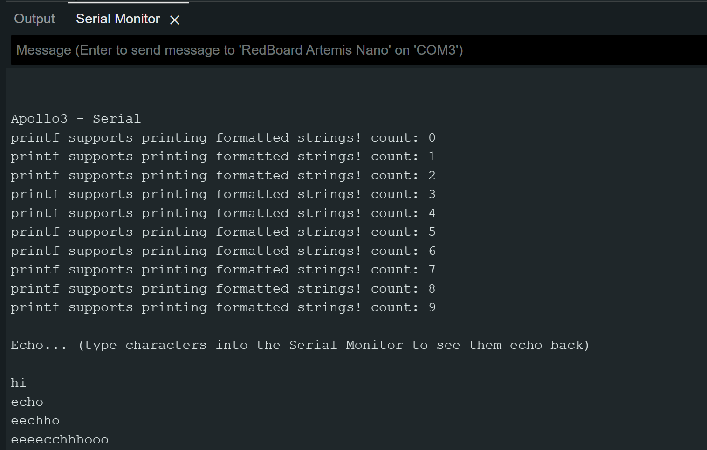
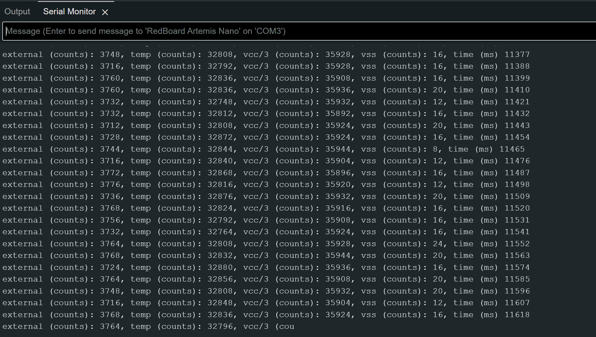
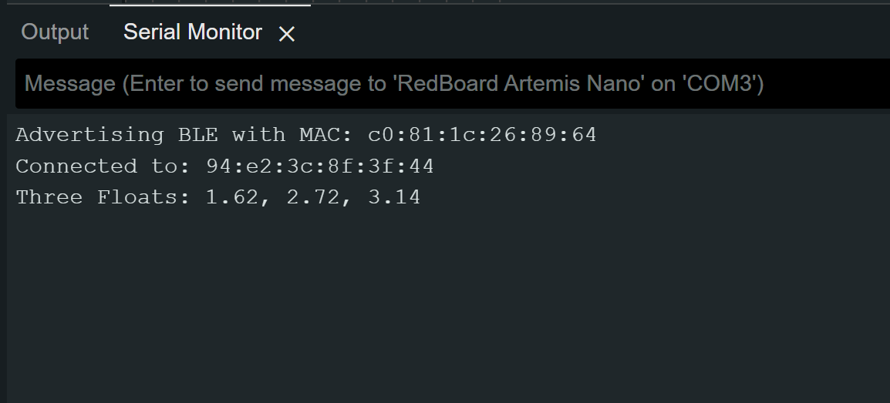

# Lab 1: The Artemis board and Bluetooth
In this lab, I set up and tested the SparkFun RedBoard Artemis Nano, using the Arduino IDE to program the board. I tested various onboard components such as the LED, temperature sensor, and microphone. I also explored Bluetooth connectivity for communication between the board and a computer, using Jupyter notebooks to send and receive data.

* * *

# Lab 1A
In this part of the lab, I ensured that the Arduino IDE was installed and updated to the latest version and tested several of the onboard components verify their functionality. Additionally, I confirmed the board's ability to communicate with the serial monitor.

## Prelab
I had already installed the Arduino IDE from a previous course, so I simply ensured it was updated to the latest version. I also installed the SparkFun Apollo3 board manager. However, I encountered some connection issues with the board and resolved them by updating the CH340 driver.


## Task 1: Blink
Following the lab manual, I tested the Blink found in File->Examples->01.Basics. This program allows for one the to test functionality of the onboard LED by toggling it on and off at one-second intervals.
<div style="display: flex; justify-content: center; align-items: center; height: 100%;">
  <iframe width="560" height="315" src="https://www.youtube.com/embed/KpyS8cVwcT8" title="Fast Robots Lab 1 Task 1: Blink" frameborder="0" allow="accelerometer; autoplay; clipboard-write; encrypted-media; gyroscope; picture-in-picture; web-share" referrerpolicy="strict-origin-when-cross-origin" allowfullscreen></iframe>
</div>
<br>

## Task 2: Serial Monitor
Next, I tested the Example4_Serial sketch found under File -> Examples -> Apollo3. This program allows the user to input a message to the board, which then echoes the message back. This test ensures the proper functionality of the serial monitor and communication between the board and the computer.




## Task 3: Temperature Sensor Test
I then tested the Example2_analogRead sketch found under File -> Examples -> Apollo3. This example uses the microcontroller’s internal ADC channels to measure various parameters, including the internal die temperature, and prints the sensor data to the serial monitor.



However, there are a few issues with the output of Example4_Serial. The serial monitor displays the temp_raw values, which are raw ADC readings from the microcontroller, so these values are not easily interpretable as temperature. Additionally, the internal VCC and VSS voltages are displayed, which were not necessary since the focus is on the temperature data. As a result, I modified the code to output only the temperature in Fahrenheit to the serial monitor.

Original:
```c
Serial.printf("temp (counts): %d, vcc/3 (counts): %d, vss (counts): %d, time (ms) %d\n", temp_raw, vcc_3, vss, millis());
```

Modified:
```c
Serial.printf("temp F (counts):");
Serial.println(temp_f,2);
```
###Changing the tempature with heat of my hand
<div style="display: flex; justify-content: center; align-items: center; height: 100%;">
  <iframe width="560" height="315" src="https://www.youtube.com/embed/AQ97GgEqi_Y" title="Fast Robots Lab 1 Task 3: Temperature Sensor Test" frameborder="0" allow="accelerometer; autoplay; clipboard-write; encrypted-media; gyroscope; picture-in-picture; web-share" referrerpolicy="strict-origin-when-cross-origin" allowfullscreen></iframe>
</div>
<br>

## Task 4: Microphone Test
Finally, I tested the Example1_MicrophoneOutput sketch found under File -> Examples -> PDM. This sketch collects audio data using the PDM microphone on the board, performs an FFT to identify the loudest frequency, and then displays that frequency on the serial monitor. I used my laptop to output various frequencies to test the microphone.
<div style="display: flex; justify-content: center; align-items: center; height: 100%;">
  <iframe width="560" height="315" src="https://www.youtube.com/embed/A70o280L-O4" title="Fast Robots Lab 2 Task 4: Microphone Test" frameborder="0" allow="accelerometer; autoplay; clipboard-write; encrypted-media; gyroscope; picture-in-picture; web-share" referrerpolicy="strict-origin-when-cross-origin" allowfullscreen></iframe>
</div>
<br>

## Discussion
After this lab, I familiarized myself with using some of the board's components, such as the LED, which I’ve used on other microcontrollers, and the microphone, which was new to me. I also relearned using Serial.print to the serial monitor, a skill that will be useful in future labs.
* * *

# Lab 1B

## Prelab

## Task 1: ECHO command
To send a string value from the computer to the Artemis board using the `ECHO` command, I implemented in the echo case to append 'Robot says ->' followed by the input text and a ':)' at the end.
```c
case ECHO:

    char char_arr[MAX_MSG_SIZE];

    // Extract the next value from the command string as a character array
    success = robot_cmd.get_next_value(char_arr);
    if (!success)
        return;

    tx_estring_value.clear();
    tx_estring_value.append("Robot says -> ");
    tx_estring_value.append(char_arr);
    tx_estring_value.append(" :)");
    tx_characteristic_string.writeValue(tx_estring_value.c_str());
    
    break;
```
I then tested it in Python to see if it worked.
```python
ble.send_command(CMD.ECHO, "HiHello")

s = ble.receive_string(ble.uuid['RX_STRING'])
print(s)
```
Ouput
> ```
> Robot says -> HiHello :)
> ```


## Task 2: Sending floats with SEND_THREE_FLOATS
To send three floats to the Artemis board using the `SEND_THREE_FLOATS` command and extract the values in the Arduino sketch, I modified the `SEND_TWO_INTS` case. Instead of two integers (int int_a, int_b), I used three floats (float float_a, float_b, float_c), and I need extracting one additional piece of data and appending it to the `char_array`.
```c
case SEND_THREE_FLOATS:

    float float_a, float_b, float_c;

    // Extract the next value from the command string as an float
    success = robot_cmd.get_next_value(float_a);
    if (!success)
        return;

    // Extract the next value from the command string as an float
    success = robot_cmd.get_next_value(float_b);
    if (!success)
        return;


    // Extract the next value from the command string as an float
    success = robot_cmd.get_next_value(float_c);
    if (!success)
        return;

    Serial.print("Three Floats: ");
    Serial.print(float_a);
    Serial.print(", ");
    Serial.print(float_b);
    Serial.print(", ");
    Serial.println(float_c);

    break;
```
Then, I tested it using the Python script to verify that the floats were correctly sent from my computer to the mircocontroller, where they would be extracted and printed to the serial monitor.
```python
ble.send_command(CMD.SEND_THREE_FLOATS, "1.618|2.718|3.141")
```


## Task 3: Sending time data with GET_TIME_MILLIS
To add the `GET_TIME_MILLIS command`, I retrieved data from the Artemis's onboard timer using the `millis()` function and then appended the data in a similar manner to the previous tasks.
```c
case GET_TIME_MILLIS: 
    int time;
    time = (int)millis();
    tx_estring_value.clear();
    tx_estring_value.append("T:");
    tx_estring_value.append(time);
    tx_characteristic_string.writeValue(tx_estring_value.c_str());

    Serial.print("Sent back: ");
    Serial.println(tx_estring_value.c_str());

    break;
```
I also added a new command type to `CommandTypes` and the `class CMD(Enum)`.
```c
enum CommandTypes
{
    PING,
    SEND_TWO_INTS,
    SEND_THREE_FLOATS,
    ECHO,
    DANCE,
    SET_VEL,
    GET_TIME_MILLIS,
};
```
```python
class CMD(Enum):
    PING = 0
    SEND_TWO_INTS = 1
    SEND_THREE_FLOATS = 2
    ECHO = 3
    DANCE = 4
    SET_VEL = 5
```
I then tested it in Python to see if it worked.
```python
ble.send_command(CMD.GET_TIME_MILLIS, "")

s = ble.receive_string(ble.uuid['RX_STRING'])
print(s)
```
Ouput
> ```
> T:110092
> ```

## Task 4: Setup Notification Handler
The next step was to set up a notification handler in Python to receive the string value from the Artemis board and extract the time from it. This would allow the data string from the Artemis to be automatically received and printed.
```python
time_data = []

def notification_handler(uuid, notification):
    s = ble.bytearray_to_string(notification)
    print(s)
    time_data.append(s.split(":")[1])
ble.start_notify(ble.uuid['RX_STRING'], notification_handler)
```
I modified my notification handler for Task 7 to receive both time and temperature data. This modification allowed it to differentiate between colons and commas, and assess whether the data contained only time values or both temperature and time values.
```python
import re
time_data, temp_data = [],[]

def notification_handler(uuid, notification):
    s = ble.bytearray_to_string(notification)
    print(s)
    data = re.split(r"[:,\s]+", s)
    time_data.append(int(data[1]))
    if(len(data)>3):
        temp_data.append(float(data[3]))
ble.start_notify(ble.uuid['RX_STRING'], notification_handler)
```

## Task 5: Looping GET_TIME_MILLIS command
I developed a `LOOP_GET_TIME_MILLIS` that continuously retrieves the current time in milliseconds and sends it to the laptop for processing by the notification handler. The logic of `GET_TIME_MILLIS` was incorporated into a while loop, which ran until a specified duration was reached. I also added a new command type to `CommandTypes` and the `class CMD(Enum)`. I also streamlined the process of adding values to the `char_array`. Instead of using a separate append statement for each new data type, I opted to use `sprintf()` to directly format and store the values into the `char_array`.
```c
case LOOP_GET_TIME_MILLIS: {
    int count = 1;
    unsigned long start_time = millis();

    while (millis() - start_time < 5000) {

      // tx_estring_value.clear(); 
      // tx_estring_value.append("T");
      // tx_estring_value.append(count);
      // tx_estring_value.append(":");
      // tx_estring_value.append((int)millis());
      // tx_characteristic_string.writeValue(tx_estring_value.c_str());
      
      tx_estring_value.clear();
      sprintf(tx_estring_value.char_array, "T%d:%d", count, (int)millis());
      tx_characteristic_string.writeValue(tx_estring_value.c_str());
      count++;
    }

    break;
}
```
I then tested it in Python to see if it worked.
```python
ble.send_command(CMD.LOOP_GET_TIME_MILLIS, "")
```
Portion of the Ouput
> ```
> T1:3090580
> T2:3090580
> T3:3090580
> T4:3090581
> T5:3090642
> T6:3090703
> T7:3090703
> T8:3090756
> T9:3090766
> 10:3090766
> ```
146 timestamps were sent by the Arduino in 5 seconds, indicating a data transfer rate of about 29 messages/second.

## Task 6: Using Time Array to in SEND_TIME_DATA
The task required creating an array of timestamps to store a chunk of data and send it all at once, rather than sending each data point individually. I first created a global time_data array, with its size limiting the amount of data that could be stored in the array.

```c
const int array_size = 5000;
int time_data[array_size];
float temp_data[array_size];
```
I then stored values in the time_data array using a while loop, restricted by both a time limit and the maximum amount of data the array could hold. A for loop was subsequently used to retrieve each timestamp from the array and format it into a string for transmission to my computer. I added `memset`because I noticed between some runs of `SEND_TIME_DATA` Python old values would be stored and not replaced.

```c
case SEND_TIME_DATA: {
    memset(time_data, 0, sizeof(time_data));
    int i = 0;

    unsigned long start_time = millis(); 
    while ((millis() - start_time < 10) && (i < array_size)) {
        
        time_data[i] = (int) millis();
        i++;
    }

    //Send back the array
    for (int j = 0; j < array_size; j++) {

      if (time_data[j] != 0) {

        tx_estring_value.clear();
        sprintf(tx_estring_value.char_array, "T%d:%d", j, time_data[j]);
        tx_characteristic_string.writeValue(tx_estring_value.c_str());

      } else break;

    }

    break;
}
```
Python:
```python
ble.send_command(CMD.SEND_TIME_DATA, "")
```
Portion of the Ouput
> ```
> T0:4758603
> T1:4758603
> T2:4758603
> T3:4758603
> T4:4758603
> T5:4758603
> T6:4758603
> T7:4758603
> T8:4758603
> T9:4758603
> T10:4758603
> ```

## Task 7: Send Concurrent Temperature & Time using Arrays
Similar to the previous task, this one requires both time and temperature data to be stored in an array and sent all at once. Since it builds on the previous step, I added a global temp_data array and used the same logic as the previous task populate the array with temperature data and send it to the computer.
```c
case GET_TEMP_READINGS: {
memset(time_data, 0, sizeof(time_data));
memset(temp_data, 0, sizeof(temp_data));
int i = 0;

unsigned long start_time = millis(); 
while ((millis() - start_time < 50) && (i < array_size)) {
    
    time_data[i] = (int) millis();
    temp_data[i] =  (float) getTempDegF();
    i++;
}

//Send back the array
for (int j = 0; j < array_size; j++) {

  if (time_data[j] != 0 || temp_data[j] != 0.0) {

    tx_estring_value.clear();
    sprintf(tx_estring_value.char_array, "T%d:%d, Temp:", j, time_data[j], temp_data[j]);
    tx_estring_value.append(temp_data[j]);
    tx_characteristic_string.writeValue(tx_estring_value.c_str());

  } else break;

}

break;
}
```
Python
```python
ble.send_command(CMD.GET_TEMP_READINGS, "")
```
Portion of the Ouput
> ```
> T0:5686834, Temp:87.186
> T1:5686834, Temp:87.186
> T2:5686834, Temp:87.186
> T3:5686835, Temp:87.186
> T4:5686835, Temp:87.186
> T5:5686835, Temp:86.130
> T6:5686835, Temp:87.186
> T7:5686836, Temp:87.186
> T8:5686836, Temp:87.186
> T9:5686836, Temp:88.242
> T10:5686836, Temp:88.242
> ```

### Step 8: Compare Speed of Sending Individual Time Values (Step 5) vs Sending Time Arrays (Step 6)


## Reflection
This experiment helped me understand...
