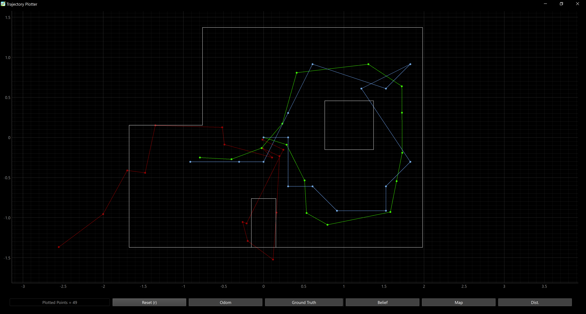

# Lab 11: Localization on the Real Robot

In Lab 11, I applied the Bayes filter on the real robot to perform localization using only the update step. Due to noisy motion, the prediction step was omitted, and localization was achieved by collecting a full 360-degree scan of distance measurements at 20-degree increments. The robot’s belief distribution was updated using these sensor readings, and the most likely position was identified as the grid cell with the highest probability. I repeated this process at four known ground truth positions to evaluate accuracy. The results were visualized and compared to the expected poses, highlighting differences in performance between simulation and real-world conditions.

* * *
 
## Test Localization in Simulation

I began the lab by running the notebook lab11_sim.ipynb to verify that the provided code correctly implemented the Bayes filter on the virtual robot. This served as a baseline to ensure that the localization module functioned as expected and mirrored the functionality developed in Lab 10.

From the results of the simulated localization, it is clear that the odometry model (red) deviates significantly from the actual trajectory. In contrast, the belief estimate (blue) closely aligns with the ground truth data (green), demonstrating the effectiveness of the Bayes filter’s update step in correcting for odometry errors.

## Discussion

This lab emphasized the challenges of real-world localization compared to simulation. Working with the physical robot reinforced the importance of accurate sensor alignment and consistent rotation behavior. The experience deepened my understanding of probabilistic localization and demonstrated the gap between idealized models and practical implementation.

* * *

# Acknowledgements
*   I referenced Stephan Wagner's page.
*   I used Josh Simpson's RC car

