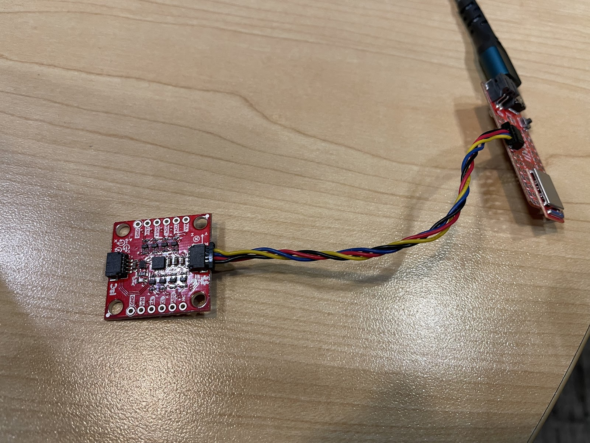
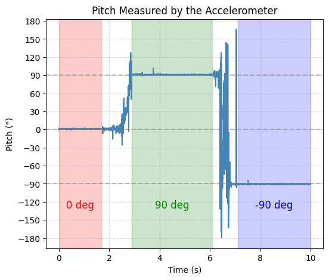
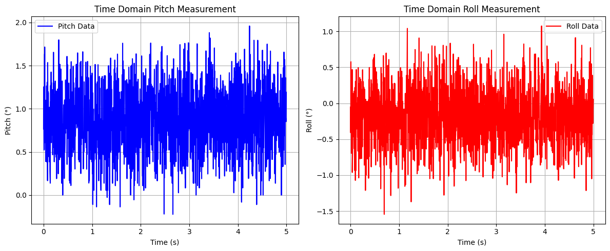
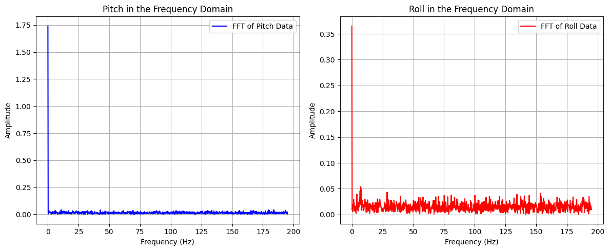
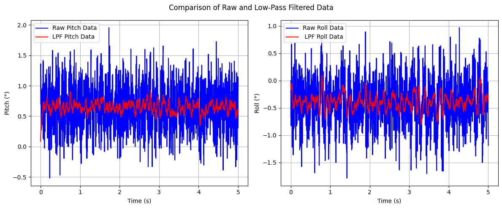
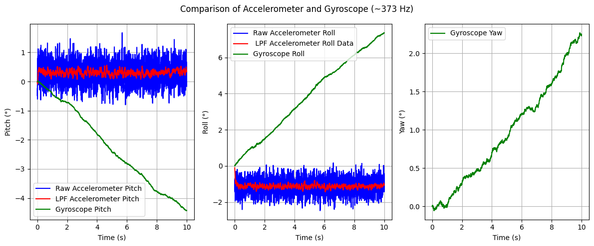
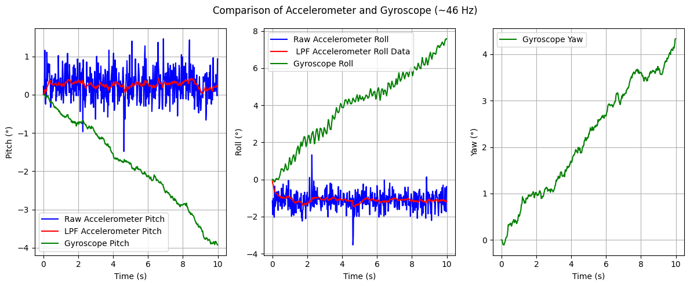

# Lab 2: IMU
In this lab, I set up an Inertial Measurement Unit (IMU) to analyze accelerometer and gyroscope data and used filtering techniques to improve signal accuracy. I concluded the lab with an RC car stunt to to test out the capabilities of the RC car.

* * *


# Prelab
I familiarized myself with the SparkFun 9DOF IMU Breakout board, including its functionality and the associated Arduino library and reviewed the ICM-20948 datasheet.


## Task 1: Setup the IMU
To set up the IMU, I first installed the SparkFun 9DOF IMU Breakout_ICM 20948_Arduino Library from the Arduino Library Manager and connected the IMU to the Artemis board using the QWIIC connectors.



I then ran Example1_Basics (located in File->Examples->ICM 2094->Arduino->Example1_Basics) to verify proper sensor communication. The AD0_VAL definition represents the value of the least significant bit of the I²C address. Since the ADR jumper is not closed, its value should be 1. Finally, I implemented so code to blinked the LED a couple of times on start-up to visually indicate that the board is running.
```c
 pinMode(LED_BUILTIN, OUTPUT);
 digitalWrite(LED_BUILTIN, LOW);  // Make sure the LED starts LOW (off)

 for(int i = 0; i < 6; i++){
   digitalWrite(LED_BUILTIN, !digitalRead(LED_BUILTIN));  // toggle the LED 
   delay(1000);   
```

<div style="display: flex; justify-content: center; align-items: center; height: 100%;">
  <iframe width="560" height="315" src="https://www.youtube.com/embed/A_9lWRYChoQ" title="Fast Robots Lab 2: Blink on Start-UP" frameborder="0" allow="accelerometer; autoplay; clipboard-write; encrypted-media; gyroscope; picture-in-picture; web-share" referrerpolicy="strict-origin-when-cross-origin" allowfullscreen></iframe>
</div>
<br>

## Task 2: Accelerometer
This task primarily involved obtaining pitch and roll values using an accelerometer. Since an accelerometer measures translational acceleration, it was necessary to apply geometric equations to convert this data into the corresponding rotational values for pitch and roll.

```c
pitch_data[i] =  atan2(myICM.accX(),myICM.accZ())*180/M_PI;
roll_data[i] =  atan2(myICM.accY(),myICM.accZ())*180/M_PI;
```
I then test this code by showing the output at {-90, 0, 90} degrees pitch and roll by holding the IMU in various ways against a table.

<div style="display: flex; justify-content: center;">
  
  
</div>
<br>

From the graphs, it is evident that the accelerometer output is highly accurate, making a two-point calibration unnecessary. However, the data also exhibits significant noise, which can be mitigated using a low-pass filter. Utilizing Skyfi’s FFT, a cutoff frequency of 5 Hz was selected. 




With a sampling period of 2.56 ms, the corresponding filter coefficient (α) was calculated to be 0.0746

```c
pitch_LPF[n] = alpha*pitch_data[i] + (1-alpha)*pitch_LPF[n-1];
pitch_LPF[n-1] = pitch_LPF[n];
roll_LPF[n] = alpha*roll_data[i]+ (1-alpha)*roll_LPF[n-1];
roll_LPF[n-1] = roll_LPF[n];
```





One graph represents the IMU placed on a flat surface with no pitch or roll, while the other captures random rotations applied to the IMU. The results demonstrate that the selected cutoff frequency effectively attenuates noise, producing a clearer and more stable signal.

## Task 3: Gyroscope
Similar to the accelerometer, the gyroscope's sensor data must be processed to obtain roll, pitch, and yaw values. In this case, the gyroscope measures angular velocity, requiring numerical integration to compute the corresponding angles over time.

```c
dt = (micros()-last_time)/1000000.;
last_time = micros(); 
pitch_gyro[n] = pitch_gyro[n-1] + myICM.gyrX()*dt;
roll_gyro[n] =  roll_gyro[n-1] + myICM.gyrY()*dt;
yaw_gyro[n] =  yaw_gyro[n-1] + myICM.gyrZ()*dt;
```
Next, I tested the gyroscope output while keeping roll, pitch, and yaw fixed at zero to view baseline sensor readings


Observing the gyroscope data reveals two key insights: first, the gyroscope's output exhibits less noise compared to the accelerometer; second, the gyroscope experiences accumulating error (drift), causing its readings to become less accurate over time. Subsequently, I introduced a delay to reduce the sampling rate and analyzed its impact on the gyroscope's output. This allowed for an evaluation of how different sampling frequencies affect data accuracy and drift over time.



The graph indicates that decreasing the sampling rate leads to a noisier signal and an increase in drift, reducing the overall accuracy of the gyroscope's output.


## Task 5: Stunts
The final task of the lab involved performing a stunt with the RC car to evaluate its capabilities. For this, I executed a series of flips.
<div style="display: flex; justify-content: center; align-items: center; height: 100%;">
  <iframe width="560" height="315" src="https://www.youtube.com/embed/CIH7MHozu34" title="Fast Robots Lab 2: RC Car Stunts" frameborder="0" allow="accelerometer; autoplay; clipboard-write; encrypted-media; gyroscope; picture-in-picture; web-share" referrerpolicy="strict-origin-when-cross-origin" allowfullscreen></iframe>
</div>
<br>

Controlling the RC car with the remote was challenging and imprecise, highlighting the necessity of implementing autonomous control for improved stability and maneuverability.

## Discussion
This lab highlighted the importance of managing data transmission when implementing the complementary filter, as sending excessive data can cause BLE communication to crash. Understanding this limitation will be crucial for optimizing data handling in future labs.
* * *


* * *

# Acknowledgements
*   I referenced Nila Narayan and Stephan Wagner’s pages.
