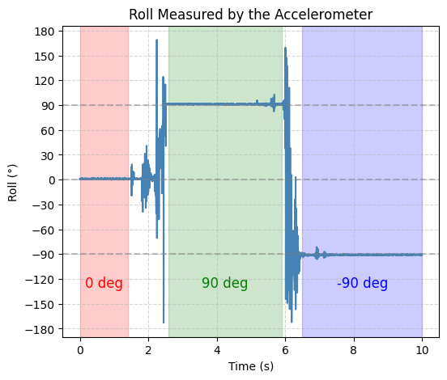

# Lab 2: IMU
In this lab, I set up an Inertial Measurement Unit (IMU) to analyze accelerometer and gyroscope data and used filtering techniques to improve signal accuracy. I concluded the lab with an RC car stunt to to test out the capabilities of the RC car.

* * *


# Prelab
I familiarized myself with the SparkFun 9DOF IMU Breakout board, including its functionality and the associated Arduino library and reviewed the ICM-20948 datasheet.


## Task 1: Setup the IMU
To set up the IMU, I first installed the SparkFun 9DOF IMU Breakout_ICM 20948_Arduino Library from the Arduino Library Manager and connected the IMU to the Artemis board using the QWIIC connectors.


I then ran Example1_Basics (located in File->Examples->ICM 2094->Arduino->Example1_Basics) to verify proper sensor communication. The AD0_VAL definition represents the value of the least significant bit of the I²C address. Since the ADR jumper is not closed, its value should be 1. Finally, I implemented so code to blinked the LED a couple of times on start-up to visually indicate that the board is running.
```c
 pinMode(LED_BUILTIN, OUTPUT);
 digitalWrite(LED_BUILTIN, LOW);  // Make sure the LED starts LOW (off)

 for(int i = 0; i < 6; i++){
   digitalWrite(LED_BUILTIN, !digitalRead(LED_BUILTIN));  // toggle the LED 
   delay(1000);   
```

<div style="display: flex; justify-content: center; align-items: center; height: 100%;">
  <iframe width="560" height="315" src="https://www.youtube.com/embed/A_9lWRYChoQ" title="Fast Robots Lab 2: Blink on Start-UP" frameborder="0" allow="accelerometer; autoplay; clipboard-write; encrypted-media; gyroscope; picture-in-picture; web-share" referrerpolicy="strict-origin-when-cross-origin" allowfullscreen></iframe>
</div>
<br>

## Task 2: Accelerometer
This task primarily involved obtaining pitch and roll values using an accelerometer. Since an accelerometer measures translational acceleration, it was necessary to apply geometric equations to convert this data into the corresponding rotational values for pitch and roll.

```c
pitch_data[i] =  atan2(myICM.accX(),myICM.accZ())*180/M_PI;
roll_data[i] =  atan2(myICM.accY(),myICM.accZ())*180/M_PI;
```
I then test this code by showing the output at {-90, 0, 90} degrees pitch and roll by holding the IMU in various ways against a table.

<div style="display: flex; justify-content: center;">
  
  
</div>
<br>

From the graphs, it is evident that the accelerometer output is highly accurate, making a two-point calibration unnecessary. However, the data also exhibits significant noise, which can be mitigated using a low-pass filter. Utilizing Skyfi’s FFT, a cutoff frequency of 5 Hz was selected. 


With a sampling period of 2.56 ms, the corresponding filter coefficient (α) was calculated to be 0.0746

```c
pitch_LPF[n] = alpha*pitch_data[i] + (1-alpha)*pitch_LPF[n-1];
pitch_LPF[n-1] = pitch_LPF[n];
roll_LPF[n] = alpha*roll_data[i]+ (1-alpha)*roll_LPF[n-1];
roll_LPF[n-1] = roll_LPF[n];
```


The graphs demonstrate that the chosen cutoff frequency effectively reduces noise, resulting in a clearer and more stable signal.

## Task 3: Gyroscope
Similar to the accelerometer, the gyroscope's sensor data must be processed to obtain roll, pitch, and yaw values. In this case, the gyroscope measures angular velocity, requiring numerical integration to compute the corresponding angles over time.

```c
dt = (micros()-last_time)/1000000.;
last_time = micros(); 
pitch_gyro[n] = pitch_gyro[n-1] + myICM.gyrX()*dt;
roll_gyro[n] =  roll_gyro[n-1] + myICM.gyrY()*dt;
yaw_gyro[n] =  yaw_gyro[n-1] + myICM.gyrZ()*dt;
```
Next, I tested the gyroscope output while keeping roll, pitch, and yaw fixed at zero to view baseline sensor readings


However, there are a few issues with the output of Example4_Serial. The serial monitor displays the temp_raw values, which are raw ADC readings from the microcontroller, so these values are not easily interpretable as temperature. Additionally, the internal VCC and VSS voltages are displayed, which were not necessary since the focus is on the temperature data. As a result, I modified the code to output only the temperature in Fahrenheit to the serial monitor.

Original:
```c
Serial.printf("temp (counts): %d, vcc/3 (counts): %d, vss (counts): %d, time (ms) %d\n", temp_raw, vcc_3, vss, millis());
```

Modified:
```c
Serial.printf("temp F (counts):");
Serial.println(temp_f,2);
```
### Changing the tempature with heat of my hand
<div style="display: flex; justify-content: center; align-items: center; height: 100%;">
  <iframe width="560" height="315" src="https://www.youtube.com/embed/AQ97GgEqi_Y" title="Fast Robots Lab 1 Task 3: Temperature Sensor Test" frameborder="0" allow="accelerometer; autoplay; clipboard-write; encrypted-media; gyroscope; picture-in-picture; web-share" referrerpolicy="strict-origin-when-cross-origin" allowfullscreen></iframe>
</div>
<br>

## Task 4: Microphone Test
Finally, I tested the Example1_MicrophoneOutput sketch found under File -> Examples -> PDM. This sketch collects audio data using the PDM microphone on the board, performs an FFT to identify the loudest frequency, and then displays that frequency on the serial monitor. I used my laptop to output various frequencies to test the microphone.
<div style="display: flex; justify-content: center; align-items: center; height: 100%;">
  <iframe width="560" height="315" src="https://www.youtube.com/embed/A70o280L-O4" title="Fast Robots Lab 1 Task 4: Microphone Test" frameborder="0" allow="accelerometer; autoplay; clipboard-write; encrypted-media; gyroscope; picture-in-picture; web-share" referrerpolicy="strict-origin-when-cross-origin" allowfullscreen></iframe>
</div>
<br>

## Task 5: Stunts
The final task of the lab involved performing a stunt with the RC car to evaluate its capabilities. For this, I executed a series of flips.
<div style="display: flex; justify-content: center; align-items: center; height: 100%;">
  <iframe width="560" height="315" src="https://www.youtube.com/embed/CIH7MHozu34" title="Fast Robots Lab 2: RC Car Stunts" frameborder="0" allow="accelerometer; autoplay; clipboard-write; encrypted-media; gyroscope; picture-in-picture; web-share" referrerpolicy="strict-origin-when-cross-origin" allowfullscreen></iframe>
</div>
<br>

## Discussion
After this lab, I familiarized myself with using some of the board's components, such as the LED, which I’ve used on other microcontrollers, and the microphone, which was new to me. I also relearned using Serial.print to the serial monitor, a skill that will be useful in future labs.
* * *


* * *

# Acknowledgements
*   I referenced Nila Narayan’s pages to understand the logic of some of the tasks in Lab 1B
