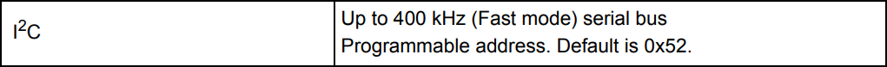
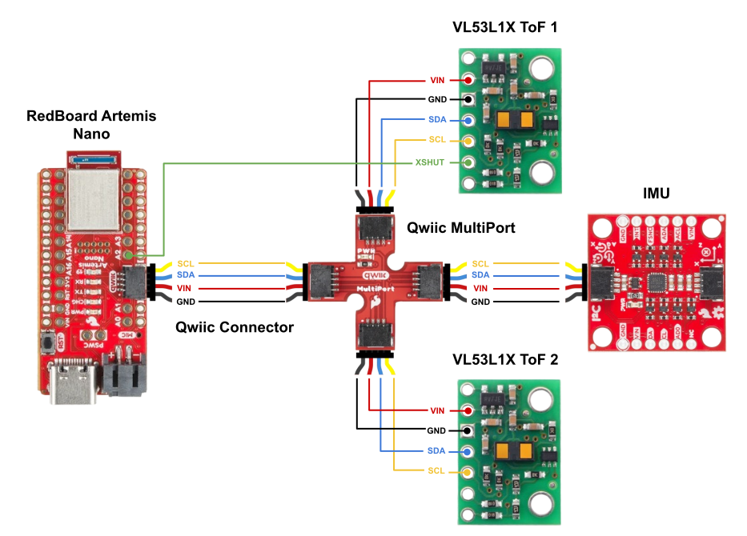
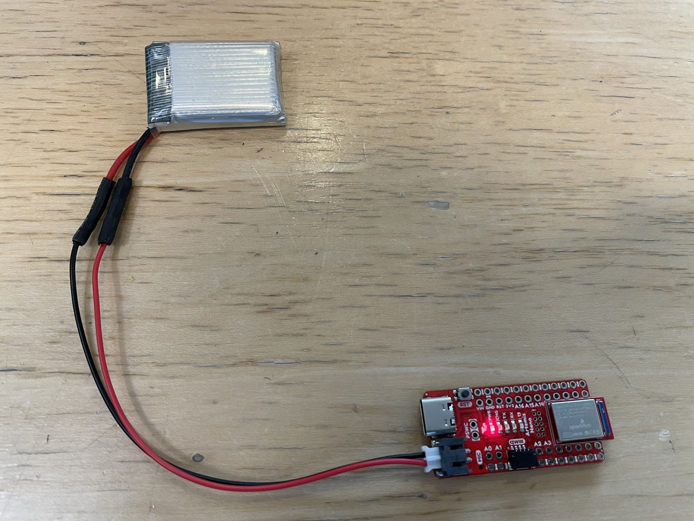
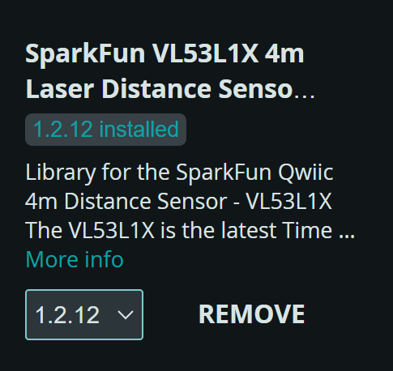
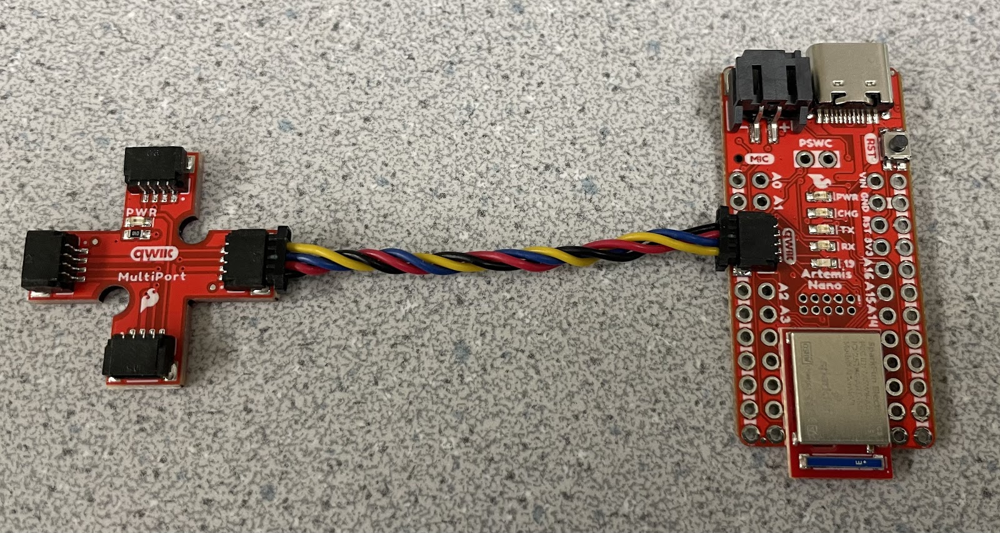
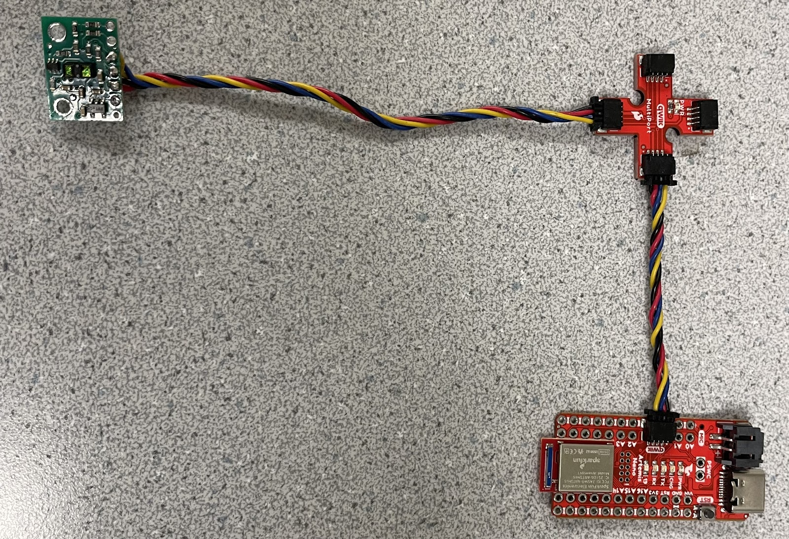
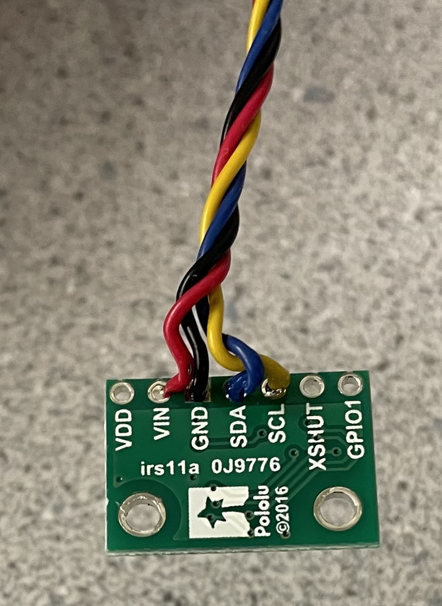
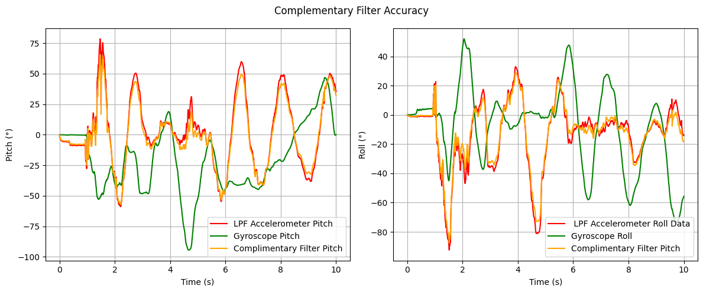

# Lab 3: ToF Sensors
In this lab, I integrated two [VL53L1X Time-of-Flight (ToF)](https://www.pololu.com/product/3415) sensors with the SparkFun RedBoard Artemis Nano and evaluated the sensors' range, accuracy, repeatability, and timing performance, selecting the optimal distance mode for future obstacle detection applications. Finally, I modified previous code to log synchronized, time-stamped ToF and IMU data, transmitting it over Bluetooth and generating plots to analyze sensor outputs over time.

* * *


## Prelab

### Default I2C Address
As per the [datasheet](https://cdn.sparkfun.com/assets/8/9/9/a/6/VL53L0X_DS.pdf), the default I2C address of the VL53L1X Tof sensor is is 0x52.


### Using 2 ToF Sensors
Since both ToF sensors share the same default I2C address, they cannot be individually addressed without modification. There are two main approaches to resolve this issue: changing the I2C address programmatically or continuously enabling and disabling the sensors using their shutdown (`XSHUT`) pins. 

I chose to change the I2C address programmatically because it allows both sensors to provide data simultaneously, improving efficiency and enabling real-time obstacle detection. To implement this, I will use the `XSHUT` pin on one of the sensors to temporarily disable it while I change the I2C address of the other. Once the address is updated, I will re-enable the disabled sensor, ensuring both sensors can operate concurrently with unique addresses on the same I2C bus.

### Ssensor Placement
I intend to place the ToF sensors on the front and back of the RC car. In most cases, the car will either need to detect an obstacle in front as it moves forward or detect an obstacle behind it while reversing. An additional consideration is that the car can flip and move in reverse, causing the "front" and "back" orientations to interchange. Placing sensors on both ends ensures consistent obstacle detection regardless of the car's orientation or direction of movement.

However, this configuration introduces a blind spot along the sides of the car. For example, if the car were moving nearly parallel to a wall but approaching it at a slight angle, the ToF sensors would be unable to detect the wall.

### Wiring Diagram


## Task 1: Battery Powering the Artemis
Since the RedBoard Artemis Nano will be mounted on the RC car, it requires an independent power source, as it cannot remain connected to my laptop during operation. To power the Artemis, I modified a 650mAh battery using a JST connector.

To make this modification, I carefully cut the battery wires one at a time to avoid short-circuiting. After identifying the power and ground connections on the JST connector (with ground as the red wire and power as the black wire in my case), I stripped the wires, slid on heat shrink tubing, and soldered the connections. Finally, I heated the tubing to insulate the exposed wires, completing the power supply setup for the Artemis.



After setting up the power source, I tested it by powering the Artemis solely with the battery, connecting via Bluetooth, and continuously retrieving timestamps using the `LOOP_GET_TIME_MILLIS` function from Lab 1.

<div style="display: flex; justify-content: center; align-items: center; height: 100%;">
  <iframe width="560" height="315" src="https://www.youtube.com/embed/rcFw6Q3UXPY" title="Fast Robots Lab 3: Connecting to Bluetooth Wirelessly" frameborder="0" allow="accelerometer; autoplay; clipboard-write; encrypted-media; gyroscope; picture-in-picture; web-share" referrerpolicy="strict-origin-when-cross-origin" allowfullscreen></iframe>
</div>
<br>


## Task 2: Install SparkFun VL53L1X 4m Laser Distance Sensor Library



## Task 2: QWIIC Connections




## Task 3: Gyroscope
Similar to the accelerometer, the gyroscope's sensor data must be processed to obtain roll, pitch, and yaw values. In this case, the gyroscope measures angular velocity, requiring numerical integration to compute the corresponding angles over time.

```c
dt = (micros()-last_time)/1000000.;
last_time = micros(); 
pitch_gyro[n] = pitch_gyro[n-1] + myICM.gyrX()*dt;
roll_gyro[n] =  roll_gyro[n-1] + myICM.gyrY()*dt;
yaw_gyro[n] =  yaw_gyro[n-1] + myICM.gyrZ()*dt;
```
Next, I tested the gyroscope output while keeping roll, pitch, and yaw fixed at zero to view baseline sensor readings


Observing the gyroscope data reveals two key insights: first, the gyroscope's output exhibits less noise compared to the accelerometer; second, the gyroscope experiences accumulating error (drift), causing its readings to become less accurate over time. Subsequently, I introduced a delay to reduce the sampling rate and analyzed its impact on the gyroscope's output. This allowed for an evaluation of how different sampling frequencies affect data accuracy and drift over time.


The graph indicates that decreasing the sampling rate leads to a noisier signal and an increase in drift, reducing the overall accuracy of the gyroscope's output.



## Task 5: Stunts
The final task of the lab involved performing a stunt with the RC car to evaluate its capabilities. For this, I executed a series of flips.
<div style="display: flex; justify-content: center; align-items: center; height: 100%;">
  <iframe width="560" height="315" src="https://www.youtube.com/embed/CIH7MHozu34" title="Fast Robots Lab 2: RC Car Stunts" frameborder="0" allow="accelerometer; autoplay; clipboard-write; encrypted-media; gyroscope; picture-in-picture; web-share" referrerpolicy="strict-origin-when-cross-origin" allowfullscreen></iframe>
</div>
<br>

Controlling the RC car with the remote was challenging and imprecise, highlighting the necessity of implementing autonomous control for improved stability and maneuverability.

## Discussion
This lab highlighted the importance of managing data transmission when implementing the complementary filter, as sending excessive data can cause BLE communication to crash. Understanding this limitation will be crucial for optimizing data handling in future labs.
* * *


* * *

# Acknowledgements
*   I referenced Nila Narayan and Stephan Wagner’s pages.
