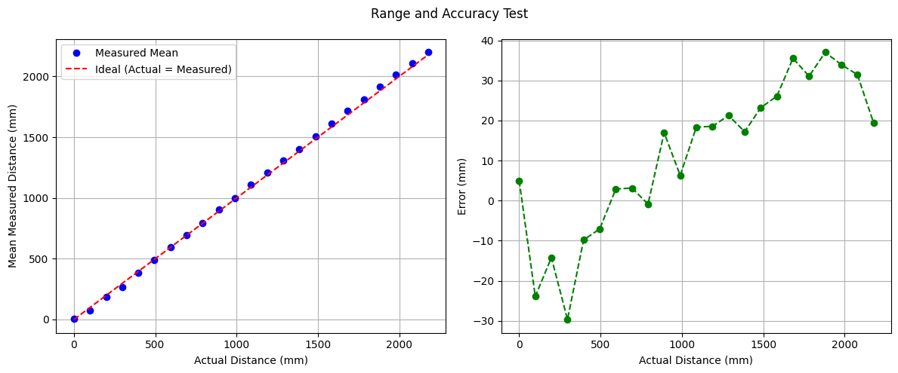

# Lab 3: ToF Sensors
In this lab, I integrated two [VL53L1X Time-of-Flight (ToF)](https://www.pololu.com/product/3415) sensors with the SparkFun RedBoard Artemis Nano and evaluated the sensors' range, accuracy, repeatability, and timing performance, selecting the optimal distance mode for future obstacle detection applications. Finally, I modified previous code to log synchronized, time-stamped ToF and IMU data, transmitting it over Bluetooth and generating plots to analyze sensor outputs over time.

* * *

## Prelab

### Default I2C Address
As per the [datasheet](https://cdn.sparkfun.com/assets/8/9/9/a/6/VL53L0X_DS.pdf), the default I2C address of the VL53L1X Tof sensor is is 0x52.


### Using 2 ToF Sensors
Since both ToF sensors share the same default I2C address, they cannot be individually addressed without modification. There are two main approaches to resolve this issue: changing the I2C address programmatically or continuously enabling and disabling the sensors using their shutdown (`XSHUT`) pins. 

I chose to change the I2C address programmatically because it allows both sensors to provide data simultaneously, improving efficiency and enabling real-time obstacle detection. To implement this, I will use the `XSHUT` pin on one of the sensors to temporarily disable it while I change the I2C address of the other. Once the address is updated, I will re-enable the disabled sensor, ensuring both sensors can operate concurrently with unique addresses on the same I2C bus.

### Ssensor Placement
I intend to place the ToF sensors on the front and back of the RC car. In most cases, the car will either need to detect an obstacle in front as it moves forward or detect an obstacle behind it while reversing. An additional consideration is that the car can flip and move in reverse, causing the "front" and "back" orientations to interchange. Placing sensors on both ends ensures consistent obstacle detection regardless of the car's orientation or direction of movement.

However, this configuration introduces a blind spot along the sides of the car. For example, if the car were moving nearly parallel to a wall but approaching it at a slight angle, the ToF sensors would be unable to detect the wall.

### Wiring Diagram


## Task 1: Battery Powering the Artemis
Since the RedBoard Artemis Nano will be mounted on the RC car, it requires an independent power source, as it cannot remain connected to my laptop during operation. To power the Artemis, I modified a 650mAh battery using a JST connector.

To make this modification, I carefully cut the battery wires one at a time to avoid short-circuiting. After identifying the power and ground connections on the JST connector (with ground as the red wire and power as the black wire in my case), I stripped the wires, slid on heat shrink tubing, and soldered the connections. Finally, I heated the tubing to insulate the exposed wires, completing the power supply setup for the Artemis.


After setting up the power source, I tested it by powering the Artemis solely with the battery, connecting via Bluetooth, and continuously retrieving timestamps using the `LOOP_GET_TIME_MILLIS` function from Lab 1.

<div style="display: flex; justify-content: center; align-items: center; height: 100%;">
  <iframe width="560" height="315" src="https://www.youtube.com/embed/rcFw6Q3UXPY" title="Fast Robots Lab 3: Connecting to Bluetooth Wirelessly" frameborder="0" allow="accelerometer; autoplay; clipboard-write; encrypted-media; gyroscope; picture-in-picture; web-share" referrerpolicy="strict-origin-when-cross-origin" allowfullscreen></iframe>
</div>
<br>


## Task 2: Install SparkFun VL53L1X 4m Laser Distance Sensor Library
<div style="text-align: center;">
  
</div>


## Task 3: QWIIC Connections
To connect multiple sensors, I used the QWIIC connector on the Artemis. Since simultaneous connections were needed, I incorporated a QWIIC MultiPort and linked it to the Artemis with a short QWIIC cable.


Afterward, I removed the JST connector from one end of the long QWIIC cable and soldered the corresponding wires to the ToF sensor following the [documentation](https://www.sparkfun.com/qwiic).
<div style="text-align: center;">
  
</div>


This is the result.


<div style="text-align: center;">
  
</div>


## Task 4: Scanning for the I2C Address
To scan the I2C address of the ToF sensor, I used the `Example05_Wire_I2C` sketch located in File->Examples->Apollo3. Below are the results from running this code in the serial monitor.


The datasheet indicates that the default address of the ToF sensor is 0x52. However, the I2C scan returned an address of 0x29. This discrepancy occurs because the least significant bit (LSB) of the address packet is reserved for indicating the read/write operation in the I2C protocol and is not part of the actual device address. The I2C scan omits this LSB, effectively performing a right shift of the address: `0b01010010 (0x52) → 0b00101001 (0x29)`.

## Task 5: ToF Sensor Mode
The ToF sensor offers three distinct modes. Short mode provides the fastest response, with a maximum range of 1.3 meters and high immunity to ambient light, but its limited range might cause it to miss distant obstacles. Medium mode extends the range to 3 meters but has a slower response and higher sensitivity to ambient light. Long mode reaches up to 4 meters, with the slowest response time and greatest susceptibility to ambient light.

Considering these factors, I believe Short mode is the most suitable option for the final robot, as its rapid response enables the Artemis to quickly receive sensor data, while its reliability under various lighting conditions ensures consistent performance.

## Task 6: Testing Short Mode
To test the ToF)sensor in my chosen mode, Short Mode, I started by reviewing the `Example1_ReadDistance` sketch found in File->Examples->SparkFun_VL53L1X_4m_Laser_Distance_Sensor.

<div style="display: flex; justify-content: center; align-items: center; height: 100%;">
  <iframe width="560" height="315" src="https://www.youtube.com/embed/7iIOYe15L4s" title="Fast Robots Lab 3: Testing ToF" frameborder="0" allow="accelerometer; autoplay; clipboard-write; encrypted-media; gyroscope; picture-in-picture; web-share" referrerpolicy="strict-origin-when-cross-origin" allowfullscreen></iframe>
</div>
<br>

I then modified this example to create a new command that sends the ToF distance data along with the time difference to my computer, allowing the data to be plotted in Jupyter Notebook for further analysis.
```c
case SEND_ONE_TOF:  {

    memset(start_time_data, 0, sizeof(start_time_data));
    memset(end_time_data, 0, sizeof(end_time_data));
    memset(time_diff_data, 0, sizeof(time_diff_data));
    memset(distance_data, 0, sizeof(distance_data));
    int i = 0;

    unsigned long start_time = millis(); 

    distanceSensor.setDistanceModeShort();
    while ((millis() - start_time < 5000) && (i < array_size) && (i < 20)) {

        distanceSensor.startRanging(); //Write configuration bytes to initiate measurement
        while (!distanceSensor.checkForDataReady())
        {
          delay(1);
        }
        start_time_data[i] = (int) micros();
        distance_data[i] = distanceSensor.getDistance(); //Get the result of the measurement from the sensor
        end_time_data[i] = (int) micros();
        distanceSensor.clearInterrupt();
        distanceSensor.stopRanging();
        time_diff_data[i] = end_time_data[i]-start_time_data[i];
        i++;

    }

    //Send back the array
    for (int j = 0; j < array_size; j++) {

      if (start_time_data[j] != 0) {

        tx_estring_value.clear();
        tx_estring_value.append("Time_diff:");
        tx_estring_value.append(time_diff_data[j]);
        tx_estring_value.append(", Distance:");
        tx_estring_value.append(distance_data[j]);
        tx_characteristic_string.writeValue(tx_estring_value.c_str());

      } else break;

    }

    break;
}
```
Subsequently, I used a testing methodology where I measured the actual distance using a measuring tape and tested the ToF sensor in 10 mm increments. At each increment, I collected 20 data points and later analyzed the data for ToF sensor range, accuracy, repeatability, and ranging time.


### ToF Range and Accuracy


The mean values collected by the ToF sensor closely match the ideal values. The error analysis indicates that the accuracy is within expected ranges, neither accurate at close distances nor accurate at longer ranges.

### Repeatability

Since reliability implies that the sensor's readings are consistent, I analyzed the mean value at each distance and examined the corresponding standard deviation. 

<div style="text-align: center;">
  
</div>


Based on the graph, the sensor behaves as expected, showing low deviation at distances below ~1.3 meters and a higher standard deviation beyond that range.

### Ranging Time
I determined the ranging time by recording the time before and after each sensor reading and calculating the difference. I then computed the mean of these values. The average ranging time I found was approximately 342 µs.

## Task 6: 2 ToF Sensors
To use two ToF sensors, I followed a similar approach to using a single sensor by connecting one with a long QWIIC cable. However, unlike the single-sensor setup, I needed to connect the shutdown pin on the ToF sensors to  the Artemis. This allowed me to temporarily disable one sensor while I assigned a unique I2C address to the other, ensuring that both sensors could operate simultaneously without address conflicts.


## Discussion


* * *

# Acknowledgements
*   I referenced Nila Narayan and Stephan Wagner’s pages.
