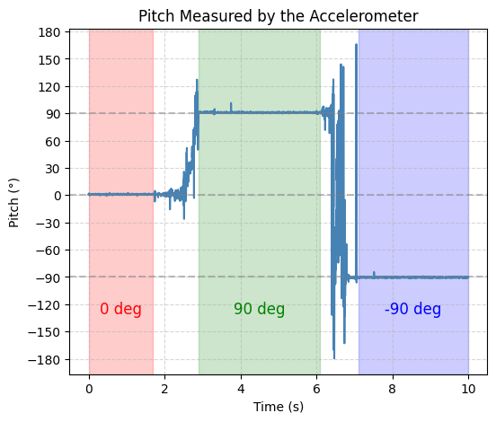
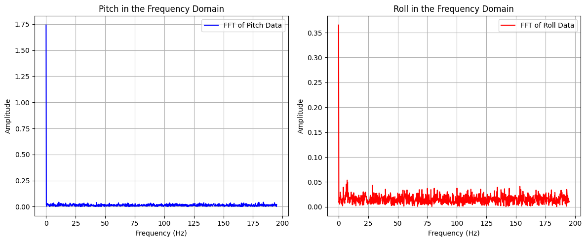
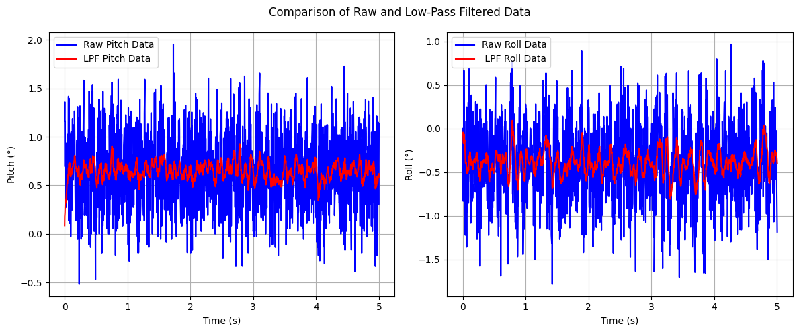

# Lab 3: ToF Sensors
In this lab, I integrated two [VL53L1X Time-of-Flight (ToF)](https://www.pololu.com/product/3415) sensors with the SparkFun RedBoard Artemis Nano and evaluated the sensors' range, accuracy, repeatability, and timing performance, selecting the optimal distance mode for future obstacle detection applications. Finally, I modified previous code to log synchronized, time-stamped ToF and IMU data, transmitting it over Bluetooth and generating plots to analyze sensor outputs over time.

* * *


## Prelab

### Default I2C Address
As per the [datasheet](https://cdn.sparkfun.com/assets/8/9/9/a/6/VL53L0X_DS.pdf), the default I2C address of the VL53L1X Tof sensor is is 0x52.


### Using 2 ToF Sensors

### Ssensor Placement
I intend to place the ToF sensors on the front and back of the RC car. In most cases, I feel the car will either need to detect an obstacle in front as it moves forward or detect an obstacle behind it while reversing. An additional consideration is that the car can flip and move in reverse, causing the "front" and "back" orientations to interchange. Placing sensors on both ends ensures consistent obstacle detection regardless of the car's orientation or direction of movement.

However, this configuration introduces a blind spot along the sides of the car. For example, if the car were moving nearly parallel to a wall but approaching it at a slight angle, the ToF sensors would be unable to detect the wall.

### Wiring Diagram


## Task 1: Battery Powering the Artemis


## Task 2: Accelerometer
This task primarily involved obtaining pitch and roll values using an accelerometer. Since an accelerometer measures translational acceleration, it was necessary to apply geometric equations to convert this data into the corresponding rotational values for pitch and roll.

```c
pitch_data[i] =  atan2(myICM.accX(),myICM.accZ())*180/M_PI;
roll_data[i] =  atan2(myICM.accY(),myICM.accZ())*180/M_PI;
```
I then test this code by showing the output at {-90, 0, 90} degrees pitch and roll by holding the IMU in various ways against a table.

<div style="display: flex; justify-content: center;">
  
  
</div>
<br>

From the graphs, it is evident that the accelerometer output is highly accurate, making a two-point calibration unnecessary. However, the data also exhibits significant noise, which can be mitigated using a low-pass filter. Utilizing Skyfi’s FFT, a cutoff frequency of 5 Hz was selected. 




With a sampling period of 2.56 ms, the corresponding filter coefficient (α) was calculated to be 0.0746

```c
pitch_LPF[n] = alpha*pitch_data[i] + (1-alpha)*pitch_LPF[n-1];
pitch_LPF[n-1] = pitch_LPF[n];
roll_LPF[n] = alpha*roll_data[i]+ (1-alpha)*roll_LPF[n-1];
roll_LPF[n-1] = roll_LPF[n];
```




One graph represents the IMU placed on a flat surface with no pitch or roll, while the other captures random rotations applied to the IMU. The results demonstrate that the selected cutoff frequency effectively attenuates noise, producing a clearer and more stable signal.

## Task 3: Gyroscope
Similar to the accelerometer, the gyroscope's sensor data must be processed to obtain roll, pitch, and yaw values. In this case, the gyroscope measures angular velocity, requiring numerical integration to compute the corresponding angles over time.

```c
dt = (micros()-last_time)/1000000.;
last_time = micros(); 
pitch_gyro[n] = pitch_gyro[n-1] + myICM.gyrX()*dt;
roll_gyro[n] =  roll_gyro[n-1] + myICM.gyrY()*dt;
yaw_gyro[n] =  yaw_gyro[n-1] + myICM.gyrZ()*dt;
```
Next, I tested the gyroscope output while keeping roll, pitch, and yaw fixed at zero to view baseline sensor readings


Observing the gyroscope data reveals two key insights: first, the gyroscope's output exhibits less noise compared to the accelerometer; second, the gyroscope experiences accumulating error (drift), causing its readings to become less accurate over time. Subsequently, I introduced a delay to reduce the sampling rate and analyzed its impact on the gyroscope's output. This allowed for an evaluation of how different sampling frequencies affect data accuracy and drift over time.


The graph indicates that decreasing the sampling rate leads to a noisier signal and an increase in drift, reducing the overall accuracy of the gyroscope's output.


## Task 5: Stunts
The final task of the lab involved performing a stunt with the RC car to evaluate its capabilities. For this, I executed a series of flips.
<div style="display: flex; justify-content: center; align-items: center; height: 100%;">
  <iframe width="560" height="315" src="https://www.youtube.com/embed/CIH7MHozu34" title="Fast Robots Lab 2: RC Car Stunts" frameborder="0" allow="accelerometer; autoplay; clipboard-write; encrypted-media; gyroscope; picture-in-picture; web-share" referrerpolicy="strict-origin-when-cross-origin" allowfullscreen></iframe>
</div>
<br>

Controlling the RC car with the remote was challenging and imprecise, highlighting the necessity of implementing autonomous control for improved stability and maneuverability.

## Discussion
This lab highlighted the importance of managing data transmission when implementing the complementary filter, as sending excessive data can cause BLE communication to crash. Understanding this limitation will be crucial for optimizing data handling in future labs.
* * *


* * *

# Acknowledgements
*   I referenced Nila Narayan and Stephan Wagner’s pages.
