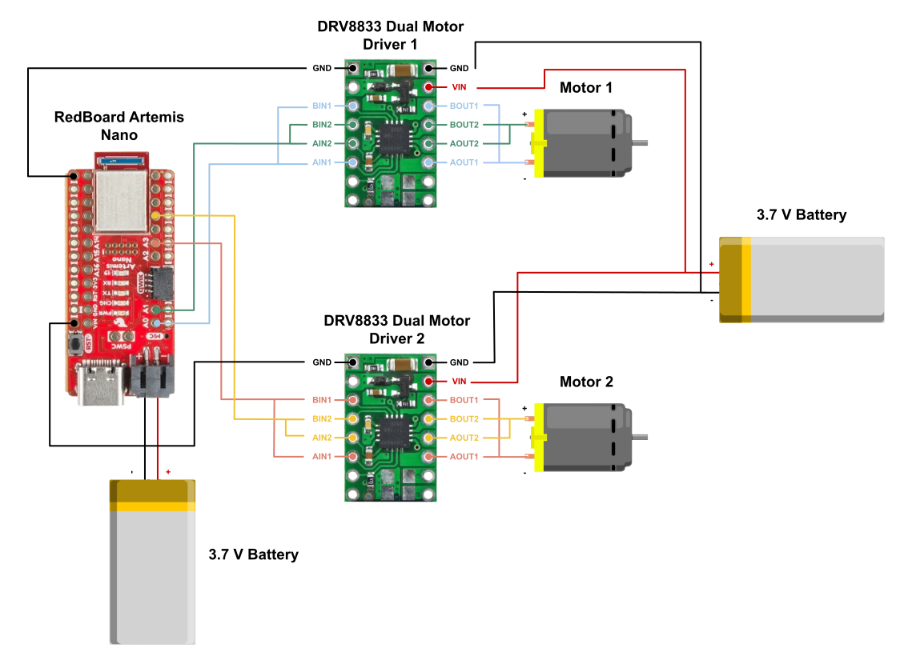
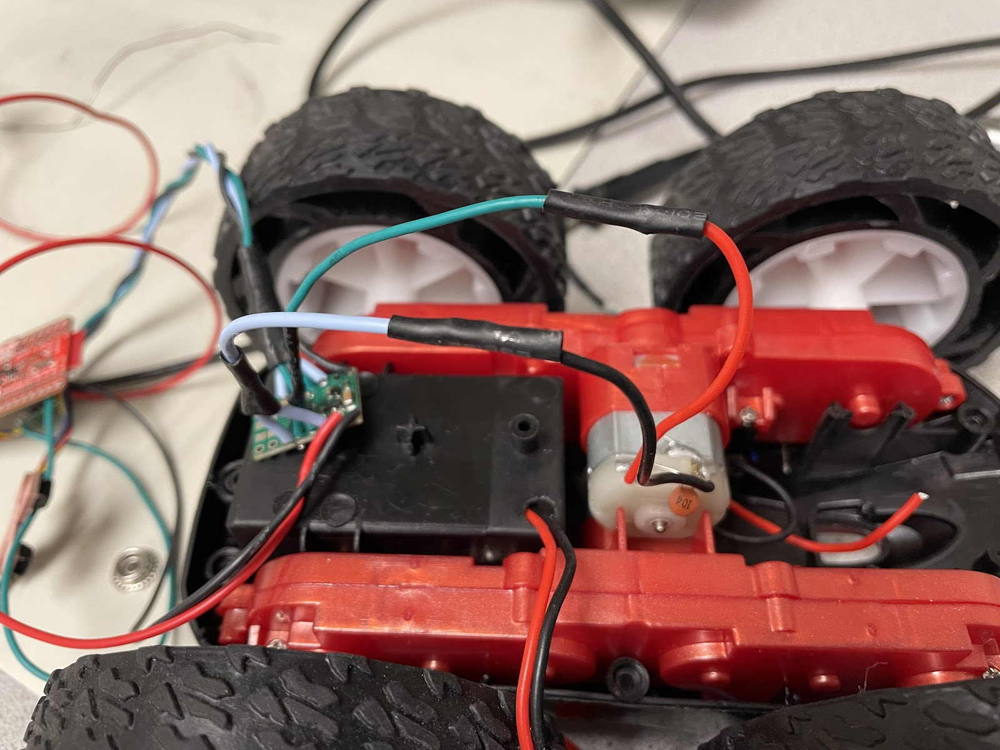
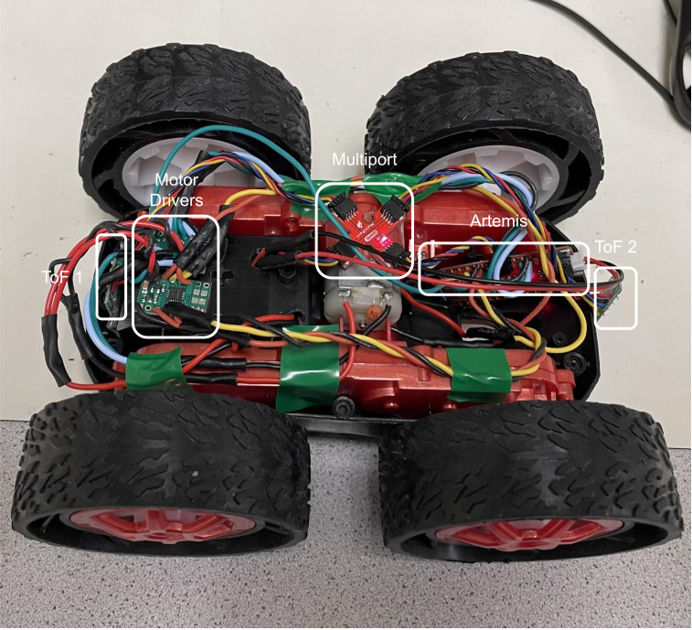
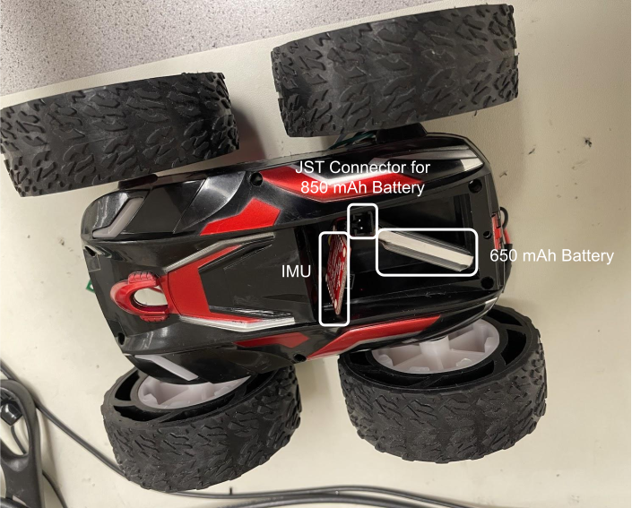
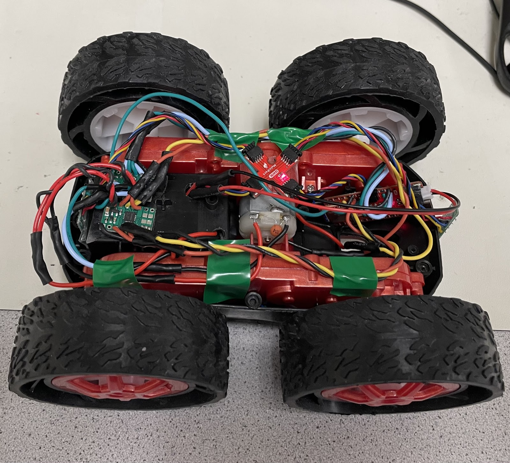
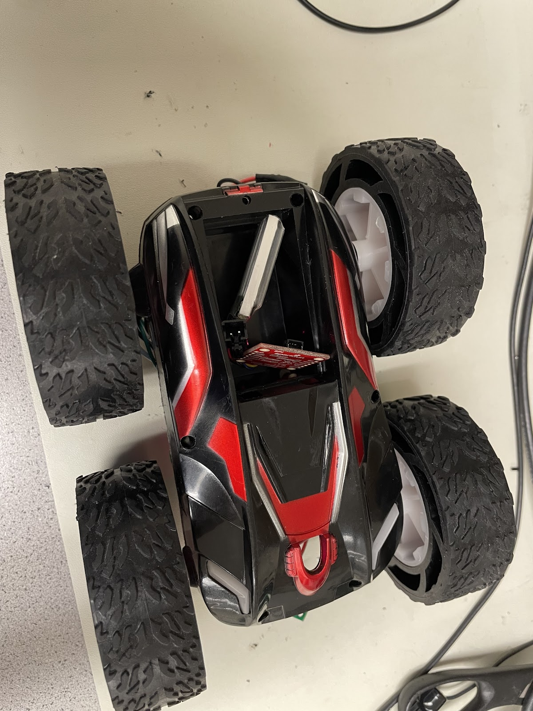
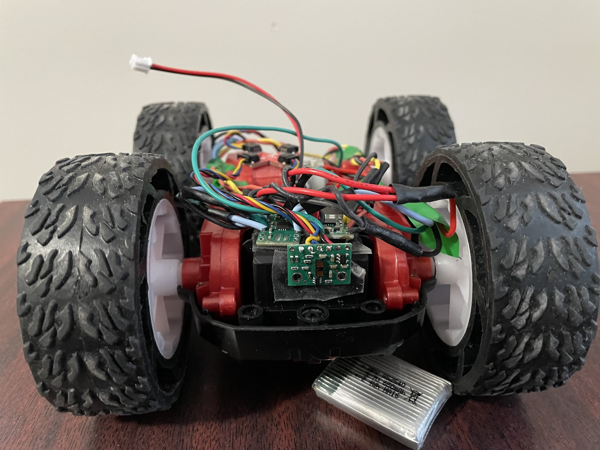
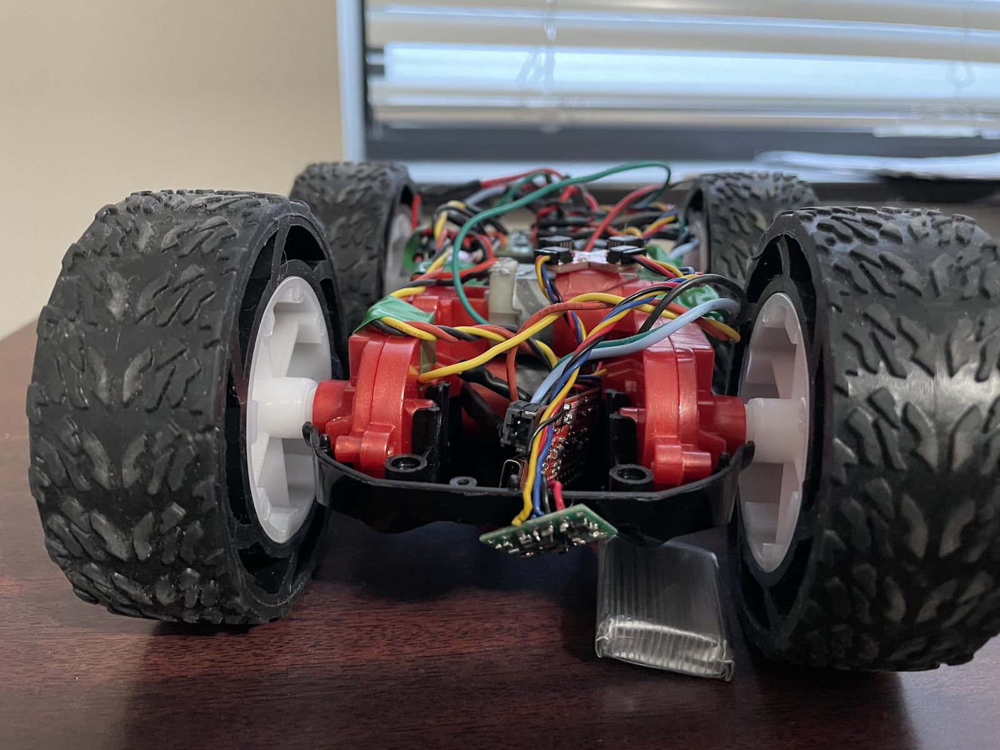

# Lab 4: Motors and Open Loop Control

I transitioned my RC car from manual control to open loop control by integrating a SparkFun RedBoard Artemis Nano with dual motor drivers.

* * *

## Prelab

### Wiring Motor Drivers

Having used digital pin 2 in the previous lab, I opted for digital pins 0, 1, 3, and 5 in this experiment since they all support PWM via the `analogWrite()` function. I connected each of these pins to an input on the motor driver using parallel-coupling to deliver twice the average current without overheating the chip. Similarly, the outputs were parallelly coupled to the positive and negative terminals of each motor for the respective motor driver. Finally, I tied together the grounds of the 3.7 V batteries, the Artemis, and the motor drivers, and connected the VIN pins of both motor drivers to the positive terminal of one of the batteries.



### Battery Discussion

I powered the Artemis and the motor drivers/motors from separate batteries because the motors draw high currents and create electrical noise that can disturb the sensitive electronics on the Artemis.

## Task 1: Connect First Motor Driver

Following the wiring diagram I created, I connected the first motor driver to pins 0 and 1 on the Artemis and tied the grounds of the Artemis and the motor driver together.


## Task 2: Generate PWM

To verify the functionality of the motor driver before integrating it into the RC car, I used a power supply to deliver 3.7 volts through the VIN pin as it replicates the battery's voltage. I then measured the output from pin 0 using an oscilloscope and the code below.

```c
#define PWM_0 0

int i = 0;

void setup() {
    pinMode(PWM_0, OUTPUT);
    analogWrite(PWM_0, 0);
}

void loop() {                             
    analogWrite(PWM_0, i);
    delay(100);
    i = (i + 10) % 255;
}
```
This is the result on the oscilloscope.

<div style="display: flex; justify-content: center; align-items: center; height: 100%;">
  <iframe width="560" height="315" src="https://www.youtube.com/embed/5iewHeBsERo" title="Fast Robots Lab 4: PWM Signal on an Oscilloscope" frameborder="0" allow="accelerometer; autoplay; clipboard-write; encrypted-media; gyroscope; picture-in-picture; web-share" referrerpolicy="strict-origin-when-cross-origin" allowfullscreen></iframe>
</div>
<br>

## Task 3: Disassemble RC Car

In order to modify the RC car to my specifications, I began by disassembling it and removing most of the original components. I carefully removed all the screws, storing them securely, and then detached the outer blue shell. Once opened, I found a PCB populated with connected LEDs and wires. I removed the PCB by cutting the wires as close as possible to preserve their maximum length for future use. With these components removed, I was left with a blank canvas with which to work.


## Task 4: Motor Driving the First Set of Wheels

After verifying the motor driver’s functionality with the oscilloscope, transitioning to using it to drive the motor was straightforward. I followed the wiring diagram and connected the outputs to the respective positive and negative leads of the motor.



The next step involved developing the code shown below to drive the wheels in both clockwise and counterclockwise directions.

```c
#define PWM_0 0
#define PWM_1 1

void setup() {
  pinMode(PWM_0, OUTPUT);
  pinMode(PWM_1, OUTPUT);
}

void loop() {
  // Drive motor clockwise:
  analogWrite(PWM_0, 0);
  analogWrite(PWM_1, 128);
  delay(5000);  // Run for 5 seconds

  // Stop motor:
  analogWrite(PWM_0, 0);
  analogWrite(PWM_1, 0);
  delay(5000);  // Pause for 5 seconds

  // Drive motor counterclockwise:
  analogWrite(PWM_0, 128);
  analogWrite(PWM_1, 0);
  delay(5000);  // Run for 5 seconds

  // Stop motor:
  analogWrite(PWM_0, 0);
  analogWrite(PWM_1, 0);
  delay(5000);  // Pause for 5 seconds
}
```

The result is the following demonstration of the wheels spinning, powered still by the 3.7 V from the external power supply.

<div style="display: flex; justify-content: center; align-items: center; height: 100%;">
  <iframe width="560" height="315" src="https://www.youtube.com/embed/-27KpS0vo1k" title="Fast Robots Lab 4: Spinning First Set of Wheels" frameborder="0" allow="accelerometer; autoplay; clipboard-write; encrypted-media; gyroscope; picture-in-picture; web-share" referrerpolicy="strict-origin-when-cross-origin" allowfullscreen></iframe>
</div>
<br>


## Task 5: Driving the First Set of Wheels Using Battery

The only change from the previous task was replacing the external power supply with an 850mAh battery (3.7 V). To achieve this, I stripped the wire connected to the JST connector for the battery, as well as the VIN and GND wires for the motor driver, and joined them using electrical tape instead of soldering. This approach was chosen to facilitate an easier extension to the other motor driver in the next task. This results in the below display.

<div style="display: flex; justify-content: center; align-items: center; height: 100%;">
  <iframe width="560" height="315" src="https://www.youtube.com/embed/5xSblaG7KSk" title="Fast Robots Lab 4: Battery Powered" frameborder="0" allow="accelerometer; autoplay; clipboard-write; encrypted-media; gyroscope; picture-in-picture; web-share" referrerpolicy="strict-origin-when-cross-origin" allowfullscreen></iframe>
</div>
<br>

## Task 6: Driving the Both Set of Wheels

To drive both sets of wheels, I connected the outputs of the second motor driver to the second motor and soldered the VIN and GND connections of both motor drivers to the battery's JST connector. I then used the updated code below to run both sets of wheels.

```c
#define PWM_0 0
#define PWM_1 1
#define PWM_3 3
#define PWM_5 5

void setup() {
    pinMode(PWM_0, OUTPUT);
    pinMode(PWM_1, OUTPUT);
    pinMode(PWM_3, OUTPUT);
    pinMode(PWM_5, OUTPUT);
}

void loop() {

  analogWrite(PWM_0, 0);
  analogWrite(PWM_1, 128);
  analogWrite(PWM_3, 0);
  analogWrite(PWM_5, 128);
  delay(5000);

  analogWrite(PWM_0, 0);
  analogWrite(PWM_1, 0);
  analogWrite(PWM_3, 0);
  analogWrite(PWM_5, 0);
  delay(5000);


  analogWrite(PWM_0, 128);
  analogWrite(PWM_1, 0);
  analogWrite(PWM_3, 128);
  analogWrite(PWM_5, 0);
  delay(5000);

  analogWrite(PWM_0, 0);
  analogWrite(PWM_1, 0);
  analogWrite(PWM_3, 0);
  analogWrite(PWM_5, 0);
  delay(5000);

}

```

The result is the following demonstration of the of all the wheels spinning, powered by the battery.

<div style="display: flex; justify-content: center; align-items: center; height: 100%;">
  <iframe width="560" height="315" src="https://www.youtube.com/embed/uuTsKM4Io_w" title="Fast Robots Lab 4: Both Motor Drivers" frameborder="0" allow="accelerometer; autoplay; clipboard-write; encrypted-media; gyroscope; picture-in-picture; web-share" referrerpolicy="strict-origin-when-cross-origin" allowfullscreen></iframe>
</div>
<br>

## Task 7: Assemble RC Car
### ;&nbsp;&nbsp;&nbsp;&nbsp;&nbsp;&nbsp;Top View&nbsp;&nbsp;&nbsp;&nbsp;&nbsp;&nbsp;&nbsp;&nbsp;&nbsp;&nbsp;&nbsp;&nbsp;&nbsp;&nbsp;&nbsp;&nbsp;&nbsp;&nbsp;&nbsp;&nbsp;&nbsp;&nbsp;&nbsp;&nbsp;&nbsp;&nbsp;&nbsp;&nbsp;&nbsp;&nbsp;&nbsp;&nbsp;&nbsp;&nbsp;&nbsp;&nbsp;&nbsp;&nbsp;&nbsp;&nbsp;&nbsp;&nbsp;Bottom View
<div style="display: flex; justify-content: center; align-items: flex-start; gap: 10px;">
  <div style="text-align: center;">
    
  </div>
  <div style="text-align: center;">
    
  </div>
</div>








I then created a Bluetooth command to remotely control the car, providing a convenient way to test its driving performance.

```c
 case DRIVE_TEST:  {

    analogWrite(PWM_0, 128);
    analogWrite(PWM_1, 0);
    analogWrite(PWM_3, 0);
    analogWrite(PWM_5, 128);
    delay(3000);


    analogWrite(PWM_0, 0);
    analogWrite(PWM_1, 0);
    analogWrite(PWM_3, 0);
    analogWrite(PWM_5, 0);

    break;
}
```

<div style="display: flex; justify-content: center; align-items: center; height: 100%;">
  <iframe width="560" height="315" src="https://www.youtube.com/embed/IydGWFwS68A" title="Fast Robots Lab 4: Driving RC Car" frameborder="0" allow="accelerometer; autoplay; clipboard-write; encrypted-media; gyroscope; picture-in-picture; web-share" referrerpolicy="strict-origin-when-cross-origin" allowfullscreen></iframe>
</div>
<br>

## Task 8: Lower Limit PWM Value

To test the lower limit of the PWM values, I developed a new Bluetooth command that sends the desired PWM values to each pin using the analogWrite() function.

```c
 case SEND_PWM_VALUE:  {
    
    int pwm_a, pwm_b, pwm_c, pwm_d;

    // Extract the next value from the command string as an integer
    success = robot_cmd.get_next_value(pwm_a);
    if (!success)
        return;

    // Extract the next value from the command string as an integer
    success = robot_cmd.get_next_value(pwm_b);
    if (!success)
        return;

    // Extract the next value from the command string as an integer
    success = robot_cmd.get_next_value(pwm_c);
    if (!success)
        return;

    // Extract the next value from the command string as an integer
    success = robot_cmd.get_next_value(pwm_d);
    if (!success)
        return;

    analogWrite(PWM_0, pwm_a);
    analogWrite(PWM_1, pwm_c);
    analogWrite(PWM_3, pwm_d);
    analogWrite(PWM_5, pwm_b);
    delay(3000);


    analogWrite(PWM_0, 0);
    analogWrite(PWM_1, 0);
    analogWrite(PWM_3, 0);
    analogWrite(PWM_5, 0);

    break;
}
```

I found that a PWM value of approximately 45 is the minimum threshold for the car to start moving forward, while a value of 120 is required for it to begin turning on its axis.

## Task 9: Calibration Factor

Calibrating with the `SEND_PWM_VALUE` command, I discovered that setting the right motor to 98 and the left motor to 128 produces a relatively straight line. This indicates a calibration factor of approximately 1.31 from right to left and, conversely, about 0.77 from left to right.

<div style="display: flex; justify-content: center; align-items: center; height: 100%;">
  <iframe width="560" height="315" ssrc="https://www.youtube.com/embed/yg1teTwbYVY" title="Fast Robots Lab 4: Straight Line" frameborder="0" allow="accelerometer; autoplay; clipboard-write; encrypted-media; gyroscope; picture-in-picture; web-share" referrerpolicy="strict-origin-when-cross-origin" allowfullscreen></iframe>
</div>
<br>

## Task 10: Open Loop Demonstration
I finally developed an open-loop command to evaluate the overall performance of my RC car by driving it straight and executing turns.

```c
case OPEN_LOOP:  {

    analogWrite(PWM_0, 70);
    analogWrite(PWM_1, 0);
    analogWrite(PWM_3, 0);
    analogWrite(PWM_5, 70);
    delay(3000);


    analogWrite(PWM_0, 128);
    analogWrite(PWM_1, 0);
    analogWrite(PWM_3, 128);
    analogWrite(PWM_5, 0);
    delay(3000);


    analogWrite(PWM_0, 128);
    analogWrite(PWM_1, 0);
    analogWrite(PWM_3, 70);
    analogWrite(PWM_5, 0);
    delay(3000);


    analogWrite(PWM_0, 128);
    analogWrite(PWM_1, 0);
    analogWrite(PWM_3, 128);
    analogWrite(PWM_5, 0);
    delay(3000);


    analogWrite(PWM_0, 0);
    analogWrite(PWM_1, 0);
    analogWrite(PWM_3, 0);
    analogWrite(PWM_5, 0);

    break;
}
```

<div style="display: flex; justify-content: center; align-items: center; height: 100%;">
  <iframe width="560" height="315" src="https://www.youtube.com/embed/1ldJYZjIpd8" title="Fast Robots Lab 4: Open Loop Control" frameborder="0" allow="accelerometer; autoplay; clipboard-write; encrypted-media; gyroscope; picture-in-picture; web-share" referrerpolicy="strict-origin-when-cross-origin" allowfullscreen></iframe>
</div>
<br>


## Discussion

This lab taught me the importance of precise wiring when working with microcontrollers. The lab provided valuable hands-on experience in motor control and system calibration, laying the groundwork for future closed-loop control enhancements.

* * *

# Acknowledgements
*   I referenced Stephan Wagner's page.

