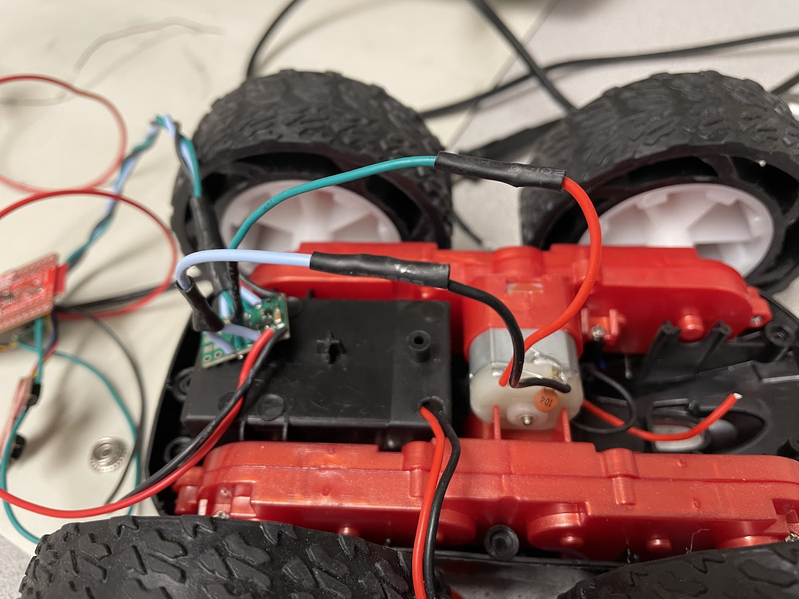
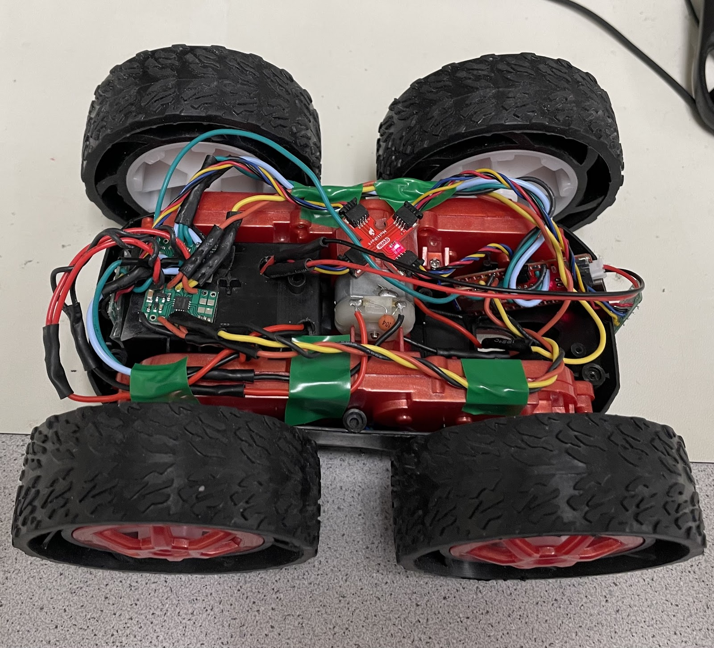
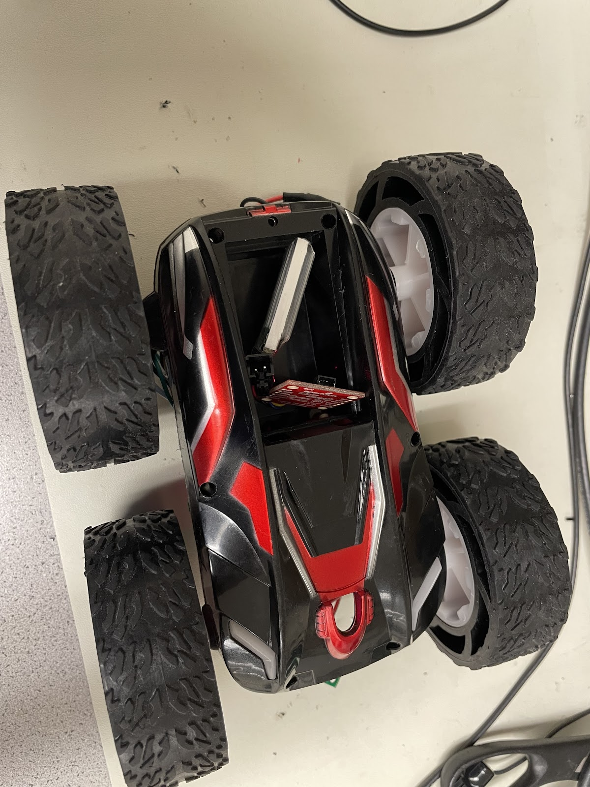
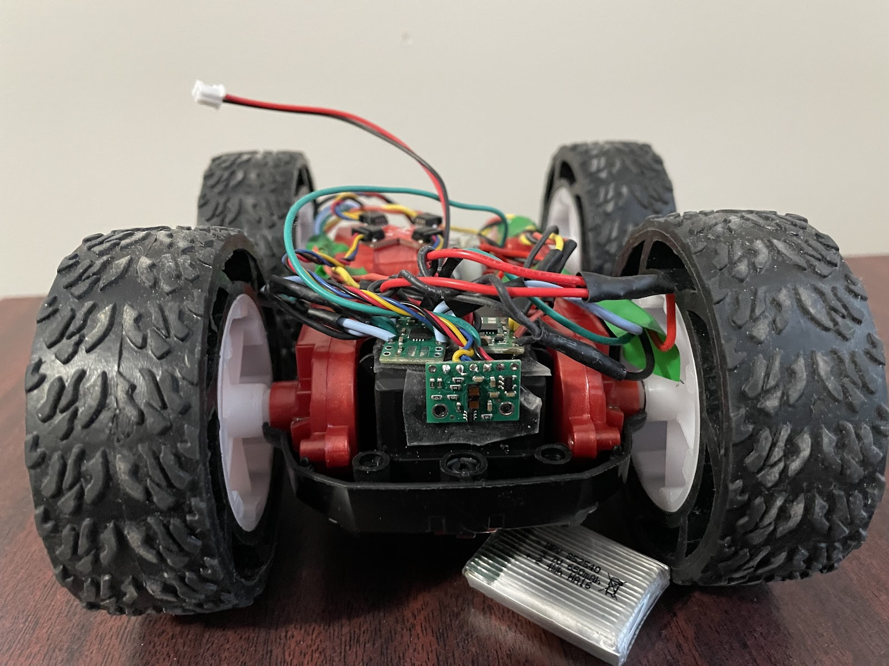
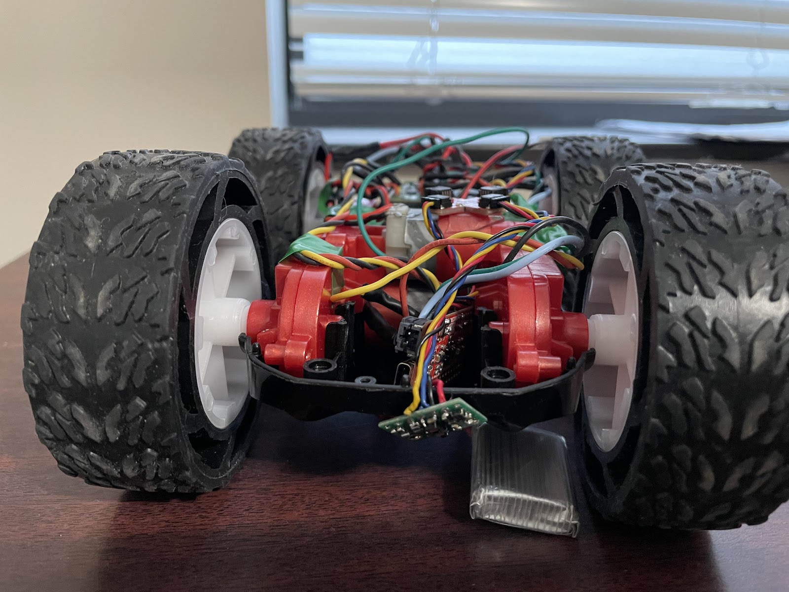
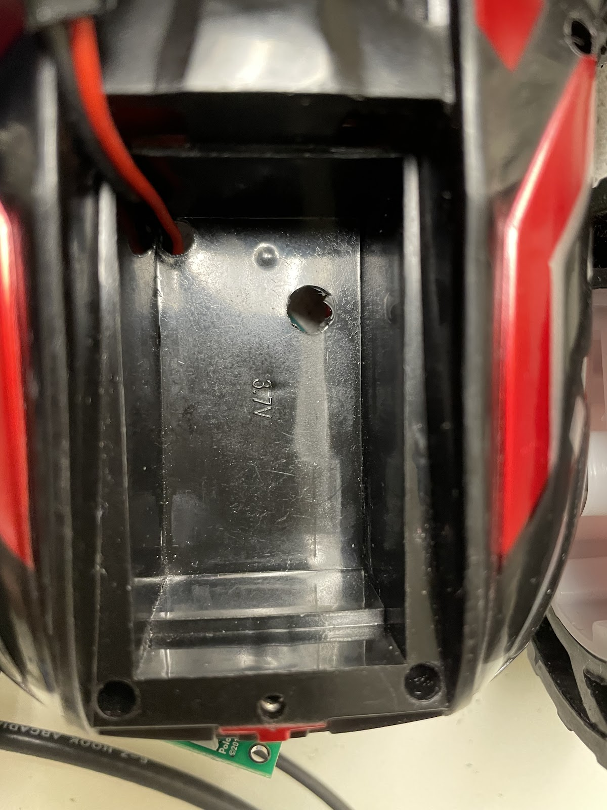

# Lab 5: Linear PID and Linear Interpolation

In Lab 5, I implemented a PID-based position control system for a RC car using a ToF sensor to accurately stop 1ft from a wall, after tuning the controller. To improve control loop speed and reduce reliance on slow ToF sensor updates, I implemented a linear extrapolation method to estimate distance in real-time, allowing the PID controller to run at a higher frequency.
* * *

## Prelab
At the end of Lab 4, I had already implemented Bluetooth communication to send motor input values, allowing me to freely test my RC car without reprogramming. For Lab 5, I modified that code to integrate PID control by creating a motorControl() function, which mapped a control to a reasonable value for `analogWrite()` for PWM-based motor actuation.
```c
void motor_control(float control_input){

    control_input = constrain(control_input, -1, 1);

    int rm_f, rm_b;
    int lm_f, lm_b;

    if (control_input >= 0) {
        rm_f = (int)round(255 * control_input);
        lm_f = (int)round(255 * control_input * calibration_factor);
        rm_b = 0;
        lm_b = 0;
    } else {
        rm_f = 0;
        lm_f = 0;
        rm_b = (int)round(-255 * control_input);
        lm_b = (int)round(-255 * control_input * calibration_factor);
    }

    analogWrite(PWM_0, lm_b);
    analogWrite(PWM_1, lm_f);
    analogWrite(PWM_3, rm_f);
    analogWrite(PWM_5, rm_b);
          
}
```
For Lab 5, I decided to implement the simplest form of control, a proportional controller, before expanding to more advanced techniques. To enable easy tuning without reprogramming, I created a Bluetooth command P, which allowed me to set an initial control input, adjust the proportional gain `K_p`, and specify a target distance. The function first applied motor_control using the initial input and then continuously updated control inputs based on the error, calculated as the difference between the measured distance from the ToF sensor and the target, multiplied by `K_p`. At the end of the run, I stopped the motors and transmitted the logged data including timestamps, measured distances, and control values back to the computer via Bluetooth for analysis and debugging.

```c
case P:  {
    
    float u_0, K_p;
    int target;

    // Extract the next value from the command string as an integer
    success = robot_cmd.get_next_value(u_0);
    if (!success)
        return;

    // Extract the next value from the command string as an integer
    success = robot_cmd.get_next_value(K_p);
    if (!success)
        return;

    // Extract the next value from the command string as an integer
    success = robot_cmd.get_next_value(target);
    if (!success)
        return;

    motor_control(u_0);

    memset(time_data, 0, sizeof(time_data));
    memset(distance_data, 0, sizeof(distance_data));
    memset(u, 0, sizeof(u));

    int i = 0;

    unsigned long start_time = millis(); 

    distanceSensor.setDistanceModeShort();
    distanceSensor.startRanging(); //Write configuration bytes to initiate measurement

    while ((millis() - start_time < 5000) && (i < array_size)) {      
        
        if (distanceSensor.checkForDataReady())
        {
          time_data[i] = (int) millis();
          distance_data[i] = distanceSensor.getDistance(); //Get the result of the measurement from the sensor
          distanceSensor.clearInterrupt();
          distanceSensor.stopRanging();
          distanceSensor.startRanging();
          float e = distance_data[i]-target;
          u[i] = K_p*e;
          motor_control(u[i]);
          // time_diff_data[i] = end_time_data[i]-start_time_data[i];

          i++;
        }


    }

    analogWrite(PWM_0, 0);
    analogWrite(PWM_1, 0);
    analogWrite(PWM_3, 0);
    analogWrite(PWM_5, 0);

    //Send back the array
    for (int j = 0; j < array_size; j++) {

      if (time_data[j] != 0) {

        tx_estring_value.clear();
        tx_estring_value.append("Time:");
        tx_estring_value.append(time_data[j]);
        tx_estring_value.append(", Distance:");
        tx_estring_value.append(distance_data[j]);
        tx_estring_value.append(", u:");
        tx_estring_value.append(u[j]);
        tx_characteristic_string.writeValue(tx_estring_value.c_str());

      } else break;

    }

    break;
}
```
To ensure my robot would stop even if the Bluetooth connection failed, I added analogWrite commands at the beginning of `setup()` to set the motor inputs to zero. This way, pressing the reset button would immediately stop the motors, preventing unintended movement if communication was lost.
```c
setup()
{
    pinMode(PWM_0, OUTPUT);
    pinMode(PWM_1, OUTPUT);
    pinMode(PWM_3, OUTPUT);
    pinMode(PWM_5, OUTPUT);

    analogWrite(PWM_0, 0);
    analogWrite(PWM_1, 0);
    analogWrite(PWM_3, 0);
    analogWrite(PWM_5, 0);
    ...
}
```

## Task 1: Position Control

Generally, a  PID controller combines proportional, integral, and derivative control terms to generate a new control input through a feedback loop. Each term contributes differently: the proportional term reacts to the current error, the integral term accounts for accumulated past errors, and the derivative term predicts future error trends.


The proportional controller that I would be trying to create would only incorporate the proportional term. 


A key drawback of a proportional controller is that it cannot fully eliminate the error between the setpoint and the actual value, as it always requires a nonzero error to generate a control effort. 
This results in a steady-state error where the system settles close to, but not exactly at, the desired target.


## Task 3: Disassemble RC Car

In order to modify the RC car to my specifications, I began by disassembling it and removing most of the original components. I carefully removed all the screws, storing them securely, and then detached the outer blue shell. Once opened, I found a PCB populated with connected LEDs and wires. I removed the PCB by cutting the wires as close as possible to preserve their maximum length for future use. With these components removed, I was left with a blank canvas with which to work.


## Task 4: Motor Driving the First Set of Wheels

After verifying the motor driver’s functionality with the oscilloscope, transitioning to using it to drive the motor was straightforward. I followed the wiring diagram and connected the outputs to the respective positive and negative leads of the motor.



The next step involved developing the code shown below to drive the wheels in both clockwise and counterclockwise directions.

```c
#define PWM_0 0
#define PWM_1 1

void setup() {
  pinMode(PWM_0, OUTPUT);
  pinMode(PWM_1, OUTPUT);
}

void loop() {
  // Drive motor clockwise:
  analogWrite(PWM_0, 0);
  analogWrite(PWM_1, 128);
  delay(5000);  // Run for 5 seconds

  // Stop motor:
  analogWrite(PWM_0, 0);
  analogWrite(PWM_1, 0);
  delay(5000);  // Pause for 5 seconds

  // Drive motor counterclockwise:
  analogWrite(PWM_0, 128);
  analogWrite(PWM_1, 0);
  delay(5000);  // Run for 5 seconds

  // Stop motor:
  analogWrite(PWM_0, 0);
  analogWrite(PWM_1, 0);
  delay(5000);  // Pause for 5 seconds
}
```

The result is the following demonstration of the wheels spinning, powered still by the 3.7 V from the external power supply.

<div style="display: flex; justify-content: center; align-items: center; height: 100%;">
  <iframe width="560" height="315" src="https://www.youtube.com/embed/-27KpS0vo1k" title="Fast Robots Lab 4: Spinning First Set of Wheels" frameborder="0" allow="accelerometer; autoplay; clipboard-write; encrypted-media; gyroscope; picture-in-picture; web-share" referrerpolicy="strict-origin-when-cross-origin" allowfullscreen></iframe>
</div>
<br>


## Task 5: Driving the First Set of Wheels Using Battery

The only change from the previous task was replacing the external power supply with an 850mAh battery (3.7 V). To achieve this, I stripped the wire connected to the JST connector for the battery, as well as the VIN and GND wires for the motor driver, and joined them using electrical tape instead of soldering. This approach was chosen to facilitate an easier extension to the other motor driver in the next task. This results in the below display.

<div style="display: flex; justify-content: center; align-items: center; height: 100%;">
  <iframe width="560" height="315" src="https://www.youtube.com/embed/5xSblaG7KSk" title="Fast Robots Lab 4: Battery Powered" frameborder="0" allow="accelerometer; autoplay; clipboard-write; encrypted-media; gyroscope; picture-in-picture; web-share" referrerpolicy="strict-origin-when-cross-origin" allowfullscreen></iframe>
</div>
<br>

## Task 6: Driving the Both Set of Wheels

To drive both sets of wheels, I connected the outputs of the second motor driver to the second motor and soldered the VIN and GND connections of both motor drivers to the battery's JST connector. I then used the updated code below to run both sets of wheels.

```c
#define PWM_0 0
#define PWM_1 1
#define PWM_3 3
#define PWM_5 5

void setup() {
    pinMode(PWM_0, OUTPUT);
    pinMode(PWM_1, OUTPUT);
    pinMode(PWM_3, OUTPUT);
    pinMode(PWM_5, OUTPUT);
}

void loop() {

  analogWrite(PWM_0, 0);
  analogWrite(PWM_1, 128);
  analogWrite(PWM_3, 0);
  analogWrite(PWM_5, 128);
  delay(5000);

  analogWrite(PWM_0, 0);
  analogWrite(PWM_1, 0);
  analogWrite(PWM_3, 0);
  analogWrite(PWM_5, 0);
  delay(5000);


  analogWrite(PWM_0, 128);
  analogWrite(PWM_1, 0);
  analogWrite(PWM_3, 128);
  analogWrite(PWM_5, 0);
  delay(5000);

  analogWrite(PWM_0, 0);
  analogWrite(PWM_1, 0);
  analogWrite(PWM_3, 0);
  analogWrite(PWM_5, 0);
  delay(5000);

}

```

The result is the following demonstration of the of all the wheels spinning, powered by the battery.

<div style="display: flex; justify-content: center; align-items: center; height: 100%;">
  <iframe width="560" height="315" src="https://www.youtube.com/embed/uuTsKM4Io_w" title="Fast Robots Lab 4: Both Motor Drivers" frameborder="0" allow="accelerometer; autoplay; clipboard-write; encrypted-media; gyroscope; picture-in-picture; web-share" referrerpolicy="strict-origin-when-cross-origin" allowfullscreen></iframe>
</div>
<br>

## Task 7: Assemble RC Car






I then created a Bluetooth command to remotely control the car, providing a convenient way to test its driving performance.

```c
 case DRIVE_TEST:  {

    analogWrite(PWM_0, 128);
    analogWrite(PWM_1, 0);
    analogWrite(PWM_3, 0);
    analogWrite(PWM_5, 128);
    delay(3000);


    analogWrite(PWM_0, 0);
    analogWrite(PWM_1, 0);
    analogWrite(PWM_3, 0);
    analogWrite(PWM_5, 0);

    break;
}
```

<div style="display: flex; justify-content: center; align-items: center; height: 100%;">
  <iframe width="560" height="315" src="https://www.youtube.com/embed/IydGWFwS68A" title="Fast Robots Lab 4: Driving RC Car" frameborder="0" allow="accelerometer; autoplay; clipboard-write; encrypted-media; gyroscope; picture-in-picture; web-share" referrerpolicy="strict-origin-when-cross-origin" allowfullscreen></iframe>
</div>
<br>

## Task 8: Lower Limit PWM Value

To test the lower limit of the PWM values, I developed a new Bluetooth command that sends the desired PWM values to each pin using the analogWrite() function.

```c
 case SEND_PWM_VALUE:  {
    
    int pwm_a, pwm_b, pwm_c, pwm_d;

    // Extract the next value from the command string as an integer
    success = robot_cmd.get_next_value(pwm_a);
    if (!success)
        return;

    // Extract the next value from the command string as an integer
    success = robot_cmd.get_next_value(pwm_b);
    if (!success)
        return;

    // Extract the next value from the command string as an integer
    success = robot_cmd.get_next_value(pwm_c);
    if (!success)
        return;

    // Extract the next value from the command string as an integer
    success = robot_cmd.get_next_value(pwm_d);
    if (!success)
        return;

    analogWrite(PWM_0, pwm_a);
    analogWrite(PWM_1, pwm_c);
    analogWrite(PWM_3, pwm_d);
    analogWrite(PWM_5, pwm_b);
    delay(3000);


    analogWrite(PWM_0, 0);
    analogWrite(PWM_1, 0);
    analogWrite(PWM_3, 0);
    analogWrite(PWM_5, 0);

    break;
}
```

I found that a PWM value of approximately 45 is the minimum threshold for the car to start moving forward, while a value of 120 is required for it to begin turning on its axis.

## Task 9: Calibration Factor

Calibrating with the `SEND_PWM_VALUE` command, I discovered that setting the right motor to 98 and the left motor to 128 produces a relatively straight line. This indicates a calibration factor of approximately 1.31 from right to left and, conversely, about 0.77 from left to right.

<div style="display: flex; justify-content: center; align-items: center; height: 100%;">
  <iframe width="560" height="315" ssrc="https://www.youtube.com/embed/yg1teTwbYVY" title="Fast Robots Lab 4: Straight Line" frameborder="0" allow="accelerometer; autoplay; clipboard-write; encrypted-media; gyroscope; picture-in-picture; web-share" referrerpolicy="strict-origin-when-cross-origin" allowfullscreen></iframe>
</div>
<br>

## Task 10: Open Loop Demonstration
I finally developed an open-loop command to evaluate the overall performance of my RC car by driving it straight and executing turns.

```c
case OPEN_LOOP:  {

    analogWrite(PWM_0, 70);
    analogWrite(PWM_1, 0);
    analogWrite(PWM_3, 0);
    analogWrite(PWM_5, 70);
    delay(3000);


    analogWrite(PWM_0, 128);
    analogWrite(PWM_1, 0);
    analogWrite(PWM_3, 128);
    analogWrite(PWM_5, 0);
    delay(3000);


    analogWrite(PWM_0, 128);
    analogWrite(PWM_1, 0);
    analogWrite(PWM_3, 70);
    analogWrite(PWM_5, 0);
    delay(3000);


    analogWrite(PWM_0, 128);
    analogWrite(PWM_1, 0);
    analogWrite(PWM_3, 128);
    analogWrite(PWM_5, 0);
    delay(3000);


    analogWrite(PWM_0, 0);
    analogWrite(PWM_1, 0);
    analogWrite(PWM_3, 0);
    analogWrite(PWM_5, 0);

    break;
}
```

<div style="display: flex; justify-content: center; align-items: center; height: 100%;">
  <iframe width="560" height="315" src="https://www.youtube.com/embed/1ldJYZjIpd8" title="Fast Robots Lab 4: Open Loop Control" frameborder="0" allow="accelerometer; autoplay; clipboard-write; encrypted-media; gyroscope; picture-in-picture; web-share" referrerpolicy="strict-origin-when-cross-origin" allowfullscreen></iframe>
</div>
<br>


## Discussion

This lab taught me the importance of precise wiring when working with microcontrollers. The lab provided valuable hands-on experience in motor control and system calibration, laying the groundwork for future closed-loop control enhancements.

* * *

# Acknowledgements
*   I referenced Stephan Wagner's page.

