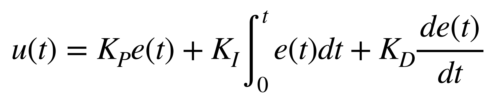

# Lab 5: Linear PID and Linear Interpolation

In Lab 5, I implemented a PID-based position control system for a RC car using a ToF sensor to accurately stop 1 ft from a wall, after tuning the controller. To improve control loop speed and reduce reliance on slow ToF sensor updates, I implemented a linear extrapolation method to estimate distance in real-time, allowing the PID controller to run at a higher frequency.
* * *

## Prelab
At the end of Lab 4, I had already implemented Bluetooth communication to send motor input values, allowing me to freely test my RC car without reprogramming. For Lab 5, I modified that code to integrate PID control by creating a motorControl() function, which mapped a control to a reasonable value for `analogWrite()` for PWM-based motor actuation.
```c
void motor_control(float control_input){

    control_input = constrain(control_input, -1, 1);

    int rm_f, rm_b;
    int lm_f, lm_b;

    if (control_input >= 0) {
        rm_f = (int)round(255 * control_input);
        lm_f = (int)round(255 * control_input * calibration_factor);
        rm_b = 0;
        lm_b = 0;
    } else {
        rm_f = 0;
        lm_f = 0;
        rm_b = (int)round(-255 * control_input);
        lm_b = (int)round(-255 * control_input * calibration_factor);
    }

    analogWrite(PWM_0, lm_b);
    analogWrite(PWM_1, lm_f);
    analogWrite(PWM_3, rm_f);
    analogWrite(PWM_5, rm_b);
          
}
```
For Lab 5, I decided to implement the simplest form of control, a proportional controller, before expanding to more advanced techniques. To enable easy tuning without reprogramming, I created a Bluetooth command P, which allowed me to set an initial control input, adjust the proportional gain `K_p`, and specify a target distance. The function first applied motor_control using the initial input and then continuously updated control inputs based on the error, calculated as the difference between the measured distance from the ToF sensor and the target, multiplied by `K_p`. At the end of the run, I stopped the motors and transmitted the logged data including timestamps, measured distances, and control values back to the computer via Bluetooth for analysis and debugging.

```c
case P:  {
    
    float u_0, K_p;
    int target;

    // Extract the next value from the command string as an integer
    success = robot_cmd.get_next_value(u_0);
    if (!success)
        return;

    // Extract the next value from the command string as an integer
    success = robot_cmd.get_next_value(K_p);
    if (!success)
        return;

    // Extract the next value from the command string as an integer
    success = robot_cmd.get_next_value(target);
    if (!success)
        return;

    motor_control(u_0);

    memset(time_data, 0, sizeof(time_data));
    memset(distance_data, 0, sizeof(distance_data));
    memset(u, 0, sizeof(u));

    int i = 0;

    unsigned long start_time = millis(); 

    distanceSensor.setDistanceModeShort();
    distanceSensor.startRanging(); //Write configuration bytes to initiate measurement

    while ((millis() - start_time < 5000) && (i < array_size)) {      
        
        if (distanceSensor.checkForDataReady())
        {
          time_data[i] = (int) millis();
          distance_data[i] = distanceSensor.getDistance(); //Get the result of the measurement from the sensor
          distanceSensor.clearInterrupt();
          distanceSensor.stopRanging();
          distanceSensor.startRanging();
          float e = distance_data[i]-target;
          u[i] = K_p*e;
          motor_control(u[i]);
          // time_diff_data[i] = end_time_data[i]-start_time_data[i];

          i++;
        }


    }

    analogWrite(PWM_0, 0);
    analogWrite(PWM_1, 0);
    analogWrite(PWM_3, 0);
    analogWrite(PWM_5, 0);

    //Send back the array
    for (int j = 0; j < array_size; j++) {

      if (time_data[j] != 0) {

        tx_estring_value.clear();
        tx_estring_value.append("Time:");
        tx_estring_value.append(time_data[j]);
        tx_estring_value.append(", Distance:");
        tx_estring_value.append(distance_data[j]);
        tx_estring_value.append(", u:");
        tx_estring_value.append(u[j]);
        tx_characteristic_string.writeValue(tx_estring_value.c_str());

      } else break;

    }

    break;
}
```
To ensure my robot would stop even if the Bluetooth connection failed, I added analogWrite commands at the beginning of `setup()` to set the motor inputs to zero. This way, pressing the reset button would immediately stop the motors, preventing unintended movement if communication was lost.
```c
setup()
{
    pinMode(PWM_0, OUTPUT);
    pinMode(PWM_1, OUTPUT);
    pinMode(PWM_3, OUTPUT);
    pinMode(PWM_5, OUTPUT);

    analogWrite(PWM_0, 0);
    analogWrite(PWM_1, 0);
    analogWrite(PWM_3, 0);
    analogWrite(PWM_5, 0);
    ...
}
```

## Task 1: Position Control

Generally, a  PID controller combines proportional, integral, and derivative control terms to generate a new control input through a feedback loop. Each term contributes differently: the proportional term reacts to the current error, the integral term accounts for accumulated past errors, and the derivative term predicts future error trends.



The proportional controller that I would be trying to create would only incorporate the proportional term. 


A key drawback of a proportional controller is that it cannot fully eliminate the error between the setpoint and the actual value, as it always requires a nonzero error to generate a control effort. 
This results in a steady-state error where the system settles close to, but not exactly at, the desired target.

### First Test

<div style="display: flex; justify-content: center; align-items: center; height: 100%;">
  <iframe width="560" height="315" src="https://www.youtube.com/embed/HsAn4sc1UuQ" title="Fast Robots Lab 5: PID Tuning" frameborder="0" allow="accelerometer; autoplay; clipboard-write; encrypted-media; gyroscope; picture-in-picture; web-share" referrerpolicy="strict-origin-when-cross-origin" allowfullscreen></iframe>
</div>
<br>


## Task 3: Extrapolation

ToF sensor was returning data at a rate of 50 ms.

## Discussion

This lab gave insights into the practical implementation of PID control in real systems. I learned how to tune a PID controller for position control, considering factors such as sensor sampling rates, and motor response.

* * *

# Acknowledgements
*   I referenced Stephan Wagner's page.

