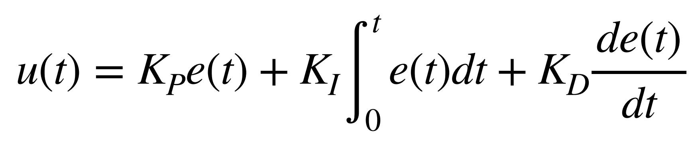
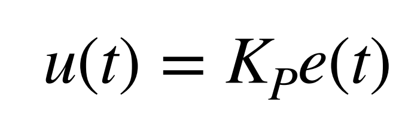

# Lab 6: Orientation Control

In Lab 6, I implemented a PID-based orientation control system for the RC car using data from the IMU to estimate yaw. I used the onboard Digital Motion Processor (DMP) for stable yaw measurements. The PID controller output a motor drive signal to rotate the robot in place toward a desired angle setpoint, which could be updated via Bluetooth.
* * *
At the end of Lab 4, I had already implemented Bluetooth communication to send motor input values, allowing me to freely test my RC car without reprogramming. 
## Prelab
For Lab 5, I created a `motorControl()` function to map the PID output to appropriate PWM values using analogWrite() for forward and backward motor actuation. In Lab 6, I built on this by implementing a new `spin_Control()` function, which drives the motors in opposite directions to induce clockwise or counter-clockwise rotation for orientation control. I reused the Bluetooth communication framework from Labs 4 and 5 to send gains and update the yaw setpoint in subsequent runs.
```c
void spin_control(float control_input){

    control_input = constrain(control_input, -1, 1);

    int rm_f, rm_b;
    int lm_f, lm_b;

    if (control_input >= 0) {
        rm_f = (int)round(255 * control_input);
        lm_f = 0;
        rm_b = 0;
        lm_b = (int)round(255 * control_input * calibration_factor);
    } else {
        rm_f = 0;
        lm_f = (int)round(-255 * control_input * calibration_factor);
        rm_b = (int)round(-255 * control_input);
        lm_b = 0;
    }

    analogWrite(PWM_0, lm_b);
    analogWrite(PWM_1, lm_f);
    analogWrite(PWM_3, rm_f);
    analogWrite(PWM_5, rm_b);
          
}
```
In pratice, it behaves like the following:

```c
case SPIN_TEST:  {
    

    spin_control(1); 

    delay(5000);

    spin_control(-1);

    delay(5000);

    analogWrite(PWM_0, 0);
    analogWrite(PWM_1, 0);
    analogWrite(PWM_3, 0);
    analogWrite(PWM_5, 0);

}
```
<div style="display: flex; justify-content: center; align-items: center; height: 100%;">
  <iframe width="560" height="315" src="https://www.youtube.com/embed/FKEZ6W0vhyw" title="Fast Robots Lab 6: Testing Spinning" frameborder="0" allow="accelerometer; autoplay; clipboard-write; encrypted-media; gyroscope; picture-in-picture; web-share" referrerpolicy="strict-origin-when-cross-origin" allowfullscreen></iframe>
</div>
<br>

To send data via Bluetooth, I used the same framework from previous labs. I call `ble.send_command()` to transmit commands, and use `robot_cmd.get_next_value()` to extract specific values I have sent with the relevant command, such as the PID gains or the desired setpoint. For receiving data, I also reused the existing structure: on the Artemi  side,  I call `tx_characteristic_string.writeValue()` with the relevant data string (`tx_estring_value.c_str()`). This string is received on the computer side via Bluetooth and parsed by a notification handler. For this lab, I focused on transmitting time, yaw angle, and control signal values.

As in Lab 5, I used analogWrite() to set all PWM values from motor control pins to zero at the beginning of setup(). This allows for me to stop the motors simply by reset in the event of a Bluetooth connection loss.
```c
setup()
{
    pinMode(PWM_0, OUTPUT);
    pinMode(PWM_1, OUTPUT);
    pinMode(PWM_3, OUTPUT);
    pinMode(PWM_5, OUTPUT);

    analogWrite(PWM_0, 0);
    analogWrite(PWM_1, 0);
    analogWrite(PWM_3, 0);
    analogWrite(PWM_5, 0);
    ...
}
```

## Proportional Control

To reiterate from Lab 5, a PID controller combines proportional, integral, and derivative control terms to generate a new control input through a feedback loop. Each term contributes differently: the proportional term reacts to the current error, the integral term accounts for accumulated past errors, and the derivative term predicts future error trends.
ropot



For Lab 6, I started by implementing a proportional controller to evaluate its performance before deciding whether an integral or derivative term was necessary.



### Using the Complimentary Filter

Building on the proportional control case from Lab 5 and the complementary filter from Lab 2, I planned to implement a proportional controller that takes in a setpoint (target angle) and a proportional gain over Bluetooth. Using the complementary filter, I estimated the yaw of the vehicle—which corresponds to the IMU’s roll axis based on its orientation in the RC car. The controller then calculates the error as the difference between the target and measured angle, multiplies it by the gain, and computes a new control input accordingly.

```c
case ORIENT_P:  {
    

    // Extract the next value from the command string as an integer
    success = robot_cmd.get_next_value(K_p);
    if (!success)
        return;

    // Extract the next value from the command string as an integer
    success = robot_cmd.get_next_value(target);
    if (!success)
        return;


    memset(time_data, 0, sizeof(time_data));
    memset(roll_data, 0, sizeof(roll_data));
    memset(roll_LPF, 0, sizeof(roll_LPF));
    memset(roll_gyro, 0, sizeof(roll_gyro));
    memset(comp_roll, 0, sizeof(comp_roll));
    memset(u, 0, sizeof(u));

    i = 0;
    n = 0;

    unsigned long start_time = millis();
    unsigned long last_time = micros(); 
    float dt =0; 

    while ((millis() - start_time < 20000) && (i < array_size)) {

        if (myICM.dataReady())
        {
          myICM.getAGMT();         // The values are only updated when you call 'getAGMT'
                                  //    printRawAGMT( myICM.agmt );     // Uncomment this to see the raw values, taken directly from the agmt structure

        dt = (micros()-last_time)/1000000.;
        last_time = micros();      
        time_data[i] = (int) millis();
        roll_data[i] =  atan2(myICM.accY(),myICM.accZ())*180/M_PI;

        n = i+1;
        roll_LPF[n] = alpha*roll_data[i]+ (1-alpha)*roll_LPF[n-1];
        roll_LPF[n-1] = roll_LPF[n];

        roll_gyro[n] =  roll_gyro[n-1] + myICM.gyrX()*dt;

        comp_roll[n] = (1 - Gamma) * roll_gyro[n] + Gamma * roll_LPF[n];

        float e = comp_roll[n]-target;
        u[i] = K_p*e;
        spin_control(u[i]);
        i++;
        }
    }

    analogWrite(PWM_0, 0);
    analogWrite(PWM_1, 0);
    analogWrite(PWM_3, 0);
    analogWrite(PWM_5, 0);

    //Send back the array
    for (int j = 0; j < array_size; j++) {

      if (time_data[j] != 0) {

        tx_estring_value.clear();
        tx_estring_value.append("Time:");
        tx_estring_value.append(time_data[j]);
        tx_estring_value.append(", roll:");
        tx_estring_value.append(comp_roll[j]);
        tx_estring_value.append(", u:");
        tx_estring_value.append(u[j]);
        tx_characteristic_string.writeValue(tx_estring_value.c_str());

      } else break;

    }

    break;
}
```
My complementary filter implementation did not work as show below.

<div style="display: flex; justify-content: center; align-items: center; height: 100%;">
  <iframe width="560" height="315" src="https://www.youtube.com/embed/6kPAHs0CVbs" title="Fast Robots Lab 6: Proportional Control Using Complimentary Filter" frameborder="0" allow="accelerometer; autoplay; clipboard-write; encrypted-media; gyroscope; picture-in-picture; web-share" referrerpolicy="strict-origin-when-cross-origin" allowfullscreen></iframe>
</div>
<br>

Thus, I decided to switch to the suggested alternative, the DMP (Digital Motion Processor), to see if it would yield better results.

### Using the DMP

Configuring the onboard Digital Motion Processor (DMP) offered several advantages, including built-in error and drift correction. By fusing data from the ICM’s 3-axis gyroscope, accelerometer, and magnetometer, the DMP can provide stable and accurate absolute orientation in the form of quaternions, which can be converted into Euler angles (yaw, pitch, and roll) for easier interpretation and control. To implement the DMP, I followed the guide on Digital Motion Processing for Orientation and included the recommended initialization code within my setup() function:
```c
bool success = true;

// Initialize the DMP
success &= (myICM.initializeDMP() == ICM_20948_Stat_Ok);

// Enable the DMP Game Rotation Vector sensor
success &= (myICM.enableDMPSensor(INV_ICM20948_SENSOR_GAME_ROTATION_VECTOR) == ICM_20948_Stat_Ok);

// Set the DMP output data rate (ODR): value = (DMP running rate / ODR ) - 1
// E.g. for a 5Hz ODR rate when DMP is running at 55Hz, value = (55/5) - 1 = 10.
success &= (myICM.setDMPODRrate(DMP_ODR_Reg_Quat6, 0) == ICM_20948_Stat_Ok); // Set to the maximum

// Enable the FIFO queue
success &= (myICM.enableFIFO() == ICM_20948_Stat_Ok);

// Enable the DMP
success &= (myICM.enableDMP() == ICM_20948_Stat_Ok);

// Reset DMP
success &= (myICM.resetDMP() == ICM_20948_Stat_Ok);

// Reset FIFO
success &= (myICM.resetFIFO() == ICM_20948_Stat_Ok);

// Check success
if (!success) {
    Serial.println("Enabling DMP failed!");
    while (1) {
        // Freeze
    }
}
```
Next, I applied the framework for retrieving quaternions from the DMP, as outlined in the guide, and converted them to the corresponding Euler angle, yaw. To implement the proportional controller, I calculated the error by subtracting the measured yaw from the setpoint and then multiplied it by the proportional gain to determine the control input at each time step, as shown in the following code.

```c
case ORIENT_DMP_P:  {
    

    // Extract the next value from the command string as an integer
    success = robot_cmd.get_next_value(K_p);
    if (!success)
        return;

    // Extract the next value from the command string as an integer
    success = robot_cmd.get_next_value(target);
    if (!success)
        return;

    memset(time_data, 0, sizeof(time_data));
    memset(yaw_data, 0, sizeof(yaw_data));
    memset(u, 0, sizeof(u));

    i = 0;

    unsigned long start_time = millis();

    while ((millis() - start_time < 20000) && (i < array_size)) {

        icm_20948_DMP_data_t data;
        myICM.readDMPdataFromFIFO(&data);

        // Is valid data available?
        if ((myICM.status == ICM_20948_Stat_Ok) || (myICM.status == ICM_20948_Stat_FIFOMoreDataAvail)) {
            // We have asked for GRV data so we should receive Quat6
            if ((data.header & DMP_header_bitmap_Quat6) > 0) {
                double qy = ((double)data.Quat6.Data.Q1) / 1073741824.0; // Convert to double. Divide by 2^30
                double qx = ((double)data.Quat6.Data.Q2) / 1073741824.0; // Convert to double. Divide by 2^30
                double qz = -((double)data.Quat6.Data.Q3) / 1073741824.0; // Convert to double. Divide by 2^30
                double qw = sqrt(1.0 - ((qy * qy) + (qx * qx) + (qz* qz)));

                // Convert the quaternion to Euler angles...

                double t3 = +2.0 * (qw * qz + qx * qy);
                double t4 = +1.0 - 2.0 * (qy * qy + qz * qz);
                yaw_data[i] = atan2(t3, t4) * 180.0 / PI;
                
                time_data[i] = (int) millis();
                float e = target-yaw_data[i];
                u[i] = K_p*e;
                spin_control(u[i]);
                i++;
                
            }
        }
        
    }

    analogWrite(PWM_0, 0);
    analogWrite(PWM_1, 0);
    analogWrite(PWM_3, 0);
    analogWrite(PWM_5, 0);

    //Send back the array
    for (int j = 0; j < array_size; j++) {

      if (time_data[j] != 0) {

        tx_estring_value.clear();
        tx_estring_value.append("Time:");
        tx_estring_value.append(time_data[j]);
        tx_estring_value.append(", yaw:");
        tx_estring_value.append(yaw_data[j]);
        tx_estring_value.append(", u:");
        tx_estring_value.append(u[j]);
        tx_characteristic_string.writeValue(tx_estring_value.c_str());

      } else break;

    }

    break;
}
```


## Discussion

This lab taught me the importance of precise wiring when working with microcontrollers. The lab provided valuable hands-on experience in motor control and system calibration, laying the groundwork for future closed-loop control enhancements.

* * *

# Acknowledgements
*   I referenced Stephan Wagner's page.

