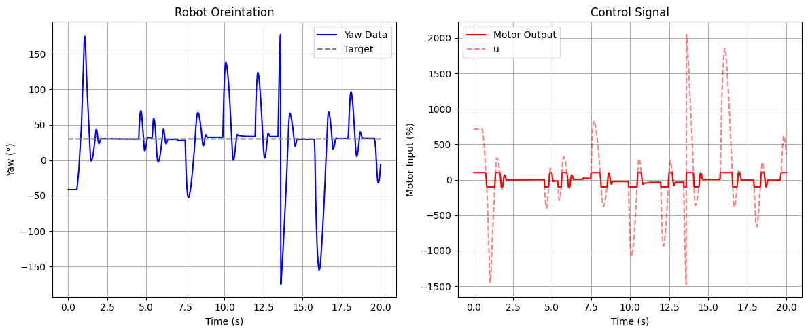

# Lab 8: Stunts

In Lab 8, I integrated all the hardware and software developed throughout the course to execute a high-speed stunt with my RC car. Given the choice between a flip and a drift, I chose the flip stunt. In this task, the robot accelerates rapidly toward a wall and, upon reaching a specific distance, performs a front flip and continues moving in reverse.

* * *
 
## Prelab
Having decided to pursue the flip stunt, I learned the general methodology for executing a flip with an RC car. The key principle involves accelerating quickly with the mass distributed toward the front of the car, then either applying a sudden brake or quickly reversing direction to initiate the flip. To explore both approaches, I implemented simple test commands to evaluate how effectively each method triggered a successful flip.

### Braking
```c
case FLIP_B:  {
    
    float u_0;

    // Extract the next value from the command string as an integer
    success = robot_cmd.get_next_value(u_0);
    if (!success)
        return;


    motor_control(u_0);

    delay(2000);

    analogWrite(PWM_0, 255);
    analogWrite(PWM_1, 255);
    analogWrite(PWM_3, 255);
    analogWrite(PWM_5, 255);

    delay(2000);

    analogWrite(PWM_0, 0);
    analogWrite(PWM_1, 0);
    analogWrite(PWM_3, 0);
    analogWrite(PWM_5, 0);

    break;
}
```

<div style="display: flex; justify-content: center; align-items: center; height: 100%;">
  <iframe width="560" height="315" src="https://www.youtube.com/embed/hNo8b9V7_ss" title="Fast Robots Lab 8: Braking Flip Test" frameborder="0" allow="accelerometer; autoplay; clipboard-write; encrypted-media; gyroscope; picture-in-picture; web-share" referrerpolicy="strict-origin-when-cross-origin" allowfullscreen></iframe>
</div>
<br>

### Reversing
```c
case FLIP_R:  {
    
    float u_0;

    // Extract the next value from the command string as an integer
    success = robot_cmd.get_next_value(u_0);
    if (!success)
        return;


    motor_control(u_0);

    delay(1000);

    analogWrite(PWM_0, 255);
    analogWrite(PWM_1, 255);
    analogWrite(PWM_3, 255);
    analogWrite(PWM_5, 255);

    delay(500);

    motor_control(-u_0);

    delay(1000);

    analogWrite(PWM_0, 255);
    analogWrite(PWM_1, 255);
    analogWrite(PWM_3, 255);
    analogWrite(PWM_5, 255);


    delay(3000);

    analogWrite(PWM_0, 0);
    analogWrite(PWM_1, 0);
    analogWrite(PWM_3, 0);
    analogWrite(PWM_5, 0);

    break;
```

<div style="display: flex; justify-content: center; align-items: center; height: 100%;">
  <iframe width="560" height="315" src="https://www.youtube.com/embed/ltD8J51-5GQ" title="Fast Robots Lab 8: Reversing Flip Test" frameborder="0" allow="accelerometer; autoplay; clipboard-write; encrypted-media; gyroscope; picture-in-picture; web-share" referrerpolicy="strict-origin-when-cross-origin" allowfullscreen></iframe>
</div>
<br>

As shown in the videos, both flip methods initially failed despite using full motor power, leaving me unsure of the issue. With help from a course staff member, I discovered that my battery was undercharged, reading only 3.7 to 3.8 volts instead of the expected 4.1 to 4.2 volts, which led to insufficient speed. After switching to a fully charged battery, a new issue appeared: when sending the signal for forward to both sets of wheels, only one side would spin. When sending the signal for backward, only the opposite side would spin instead. Faced with these motor control problems, I ultimately borrowed a classmate’s RC car to complete the stunt.


## Proportional Control

To reiterate from Lab 5, a PID controller combines proportional, integral, and derivative control terms to generate a new control input through a feedback loop. Each term contributes differently: the proportional term reacts to the current error, the integral term accounts for accumulated past errors, and the derivative term predicts future error trends.
ropot


For Lab 6, I started by implementing a proportional controller to evaluate its performance before deciding whether an integral or derivative term was necessary.


### Using the Complimentary Filter

Building on the proportional control case from Lab 5 and the complementary filter from Lab 2, I planned to implement a proportional controller that takes in a setpoint (target angle) and a proportional gain over Bluetooth. Using the complementary filter, I estimated the yaw of the vehicle—which corresponds to the IMU’s roll axis based on its orientation in the RC car. The controller then calculates the error as the difference between the target and measured angle, multiplies it by the gain, and computes a new control input accordingly.

```c
case ORIENT_P:  {
    

    // Extract the next value from the command string as an integer
    success = robot_cmd.get_next_value(K_p);
    if (!success)
        return;

    // Extract the next value from the command string as an integer
    success = robot_cmd.get_next_value(target);
    if (!success)
        return;


    memset(time_data, 0, sizeof(time_data));
    memset(roll_data, 0, sizeof(roll_data));
    memset(roll_LPF, 0, sizeof(roll_LPF));
    memset(roll_gyro, 0, sizeof(roll_gyro));
    memset(comp_roll, 0, sizeof(comp_roll));
    memset(u, 0, sizeof(u));

    i = 0;
    n = 0;

    unsigned long start_time = millis();
    unsigned long last_time = micros(); 
    float dt =0; 

    while ((millis() - start_time < 20000) && (i < array_size)) {

        if (myICM.dataReady())
        {
          myICM.getAGMT();         // The values are only updated when you call 'getAGMT'
                                  //    printRawAGMT( myICM.agmt );     // Uncomment this to see the raw values, taken directly from the agmt structure

        dt = (micros()-last_time)/1000000.;
        last_time = micros();      
        time_data[i] = (int) millis();
        roll_data[i] =  atan2(myICM.accY(),myICM.accZ())*180/M_PI;

        n = i+1;
        roll_LPF[n] = alpha*roll_data[i]+ (1-alpha)*roll_LPF[n-1];
        roll_LPF[n-1] = roll_LPF[n];

        roll_gyro[n] =  roll_gyro[n-1] + myICM.gyrX()*dt;

        comp_roll[n] = (1 - Gamma) * roll_gyro[n] + Gamma * roll_LPF[n];

        float e = comp_roll[n]-target;
        u[i] = K_p*e;
        spin_control(u[i]);
        i++;
        }
    }

    analogWrite(PWM_0, 0);
    analogWrite(PWM_1, 0);
    analogWrite(PWM_3, 0);
    analogWrite(PWM_5, 0);

    //Send back the array
    for (int j = 0; j < array_size; j++) {

      if (time_data[j] != 0) {

        tx_estring_value.clear();
        tx_estring_value.append("Time:");
        tx_estring_value.append(time_data[j]);
        tx_estring_value.append(", roll:");
        tx_estring_value.append(comp_roll[j]);
        tx_estring_value.append(", u:");
        tx_estring_value.append(u[j]);
        tx_characteristic_string.writeValue(tx_estring_value.c_str());

      } else break;

    }

    break;
}
```
My complementary filter implementation did not work as show below.

<div style="display: flex; justify-content: center; align-items: center; height: 100%;">
  <iframe width="560" height="315" src="https://www.youtube.com/embed/6kPAHs0CVbs" title="Fast Robots Lab 6: Proportional Control Using Complimentary Filter" frameborder="0" allow="accelerometer; autoplay; clipboard-write; encrypted-media; gyroscope; picture-in-picture; web-share" referrerpolicy="strict-origin-when-cross-origin" allowfullscreen></iframe>
</div>
<br>

Thus, I decided to switch to the suggested alternative, the DMP (Digital Motion Processor), to see if it would yield better results.

### Using the DMP

Configuring the onboard Digital Motion Processor (DMP) offered several advantages, including built-in error and drift correction. By fusing data from the ICM’s 3-axis gyroscope, accelerometer, and magnetometer, the DMP can provide stable and accurate absolute orientation in the form of quaternions, which can be converted into Euler angles (yaw, pitch, and roll) for easier interpretation and control. To implement the DMP, I followed the guide on Digital Motion Processing for Orientation and included the recommended initialization code within my setup() function:
```c
bool success = true;

// Initialize the DMP
success &= (myICM.initializeDMP() == ICM_20948_Stat_Ok);

// Enable the DMP Game Rotation Vector sensor
success &= (myICM.enableDMPSensor(INV_ICM20948_SENSOR_GAME_ROTATION_VECTOR) == ICM_20948_Stat_Ok);

// Set the DMP output data rate (ODR): value = (DMP running rate / ODR ) - 1
// E.g. for a 5Hz ODR rate when DMP is running at 55Hz, value = (55/5) - 1 = 10.
success &= (myICM.setDMPODRrate(DMP_ODR_Reg_Quat6, 0) == ICM_20948_Stat_Ok); // Set to the maximum

// Enable the FIFO queue
success &= (myICM.enableFIFO() == ICM_20948_Stat_Ok);

// Enable the DMP
success &= (myICM.enableDMP() == ICM_20948_Stat_Ok);

// Reset DMP
success &= (myICM.resetDMP() == ICM_20948_Stat_Ok);

// Reset FIFO
success &= (myICM.resetFIFO() == ICM_20948_Stat_Ok);

// Check success
if (!success) {
    Serial.println("Enabling DMP failed!");
    while (1) {
        // Freeze
    }
}
```
Next, I applied the framework for retrieving quaternions from the DMP, as outlined in the guide, and converted them to the corresponding Euler angle, yaw. To implement the proportional controller, I calculated the error by subtracting the measured yaw from the setpoint and then multiplied it by the proportional gain to determine the control input at each time step, as shown in the following code.

```c
case ORIENT_DMP_P:  {
    

    // Extract the next value from the command string as an integer
    success = robot_cmd.get_next_value(K_p);
    if (!success)
        return;

    // Extract the next value from the command string as an integer
    success = robot_cmd.get_next_value(target);
    if (!success)
        return;

    memset(time_data, 0, sizeof(time_data));
    memset(yaw_data, 0, sizeof(yaw_data));
    memset(u, 0, sizeof(u));

    i = 0;

    unsigned long start_time = millis();

    while ((millis() - start_time < 20000) && (i < array_size)) {

        icm_20948_DMP_data_t data;
        myICM.readDMPdataFromFIFO(&data);

        // Is valid data available?
        if ((myICM.status == ICM_20948_Stat_Ok) || (myICM.status == ICM_20948_Stat_FIFOMoreDataAvail)) {
            // We have asked for GRV data so we should receive Quat6
            if ((data.header & DMP_header_bitmap_Quat6) > 0) {
                double qy = ((double)data.Quat6.Data.Q1) / 1073741824.0; // Convert to double. Divide by 2^30
                double qx = ((double)data.Quat6.Data.Q2) / 1073741824.0; // Convert to double. Divide by 2^30
                double qz = -((double)data.Quat6.Data.Q3) / 1073741824.0; // Convert to double. Divide by 2^30
                double qw = sqrt(1.0 - ((qy * qy) + (qx * qx) + (qz* qz)));

                // Convert the quaternion to Euler angles...

                double t3 = +2.0 * (qw * qz + qx * qy);
                double t4 = +1.0 - 2.0 * (qy * qy + qz * qz);
                yaw_data[i] = atan2(t3, t4) * 180.0 / PI;
                
                time_data[i] = (int) millis();
                float e = target-yaw_data[i];
                u[i] = K_p*e;
                spin_control(u[i]);
                i++;
                
            }
        }
        
    }

    analogWrite(PWM_0, 0);
    analogWrite(PWM_1, 0);
    analogWrite(PWM_3, 0);
    analogWrite(PWM_5, 0);

    //Send back the array
    for (int j = 0; j < array_size; j++) {

      if (time_data[j] != 0) {

        tx_estring_value.clear();
        tx_estring_value.append("Time:");
        tx_estring_value.append(time_data[j]);
        tx_estring_value.append(", yaw:");
        tx_estring_value.append(yaw_data[j]);
        tx_estring_value.append(", u:");
        tx_estring_value.append(u[j]);
        tx_characteristic_string.writeValue(tx_estring_value.c_str());

      } else break;

    }

    break;
}
```
### Test the Proportional Controller

After some tuning, I settled on a proportional gain of K<sub>p</sub> = 0.1 for my controller. The following test was conducted with a target yaw angle of 30°.

<div style="display: flex; justify-content: center; align-items: center; height: 100%;">
  <iframe width="560" height="315" src="https://www.youtube.com/embed/5DzwB4r8gs8" title="Fast Robots Lab 6: P Control | Kp = 0.1, ∠30°" frameborder="0" allow="accelerometer; autoplay; clipboard-write; encrypted-media; gyroscope; picture-in-picture; web-share" referrerpolicy="strict-origin-when-cross-origin" allowfullscreen></iframe>
</div>
<br>


> Since spin_control() maps the control input u from the range [-1, 1], any u values of greater than 1 are capped at +100% (full speed clockwise), and values less than -1 are capped at -100% (full speed counterclockwise).

Based on this test, a derivative term appeared unnecessary. Derivative control is typically useful for damping oscillations, but there was very little oscillation observed. This is likely because I did not filter out the region of low PWM values that are too small to cause the RC car to rotate on its axis.


## Discussion

This lab taught me the importance of precise wiring when working with microcontrollers. The lab provided valuable hands-on experience in motor control and system calibration, laying the groundwork for future closed-loop control enhancements.

* * *

# Acknowledgements
*   I referenced Stephan Wagner's page.

