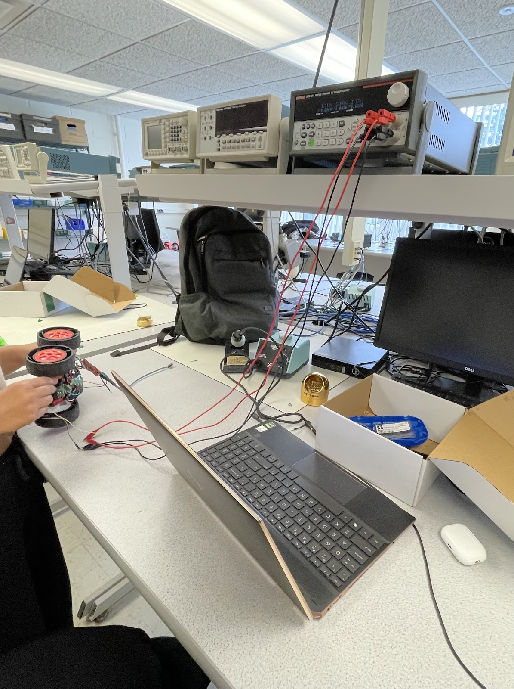
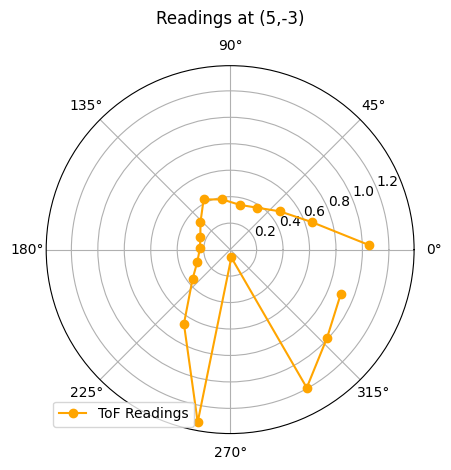
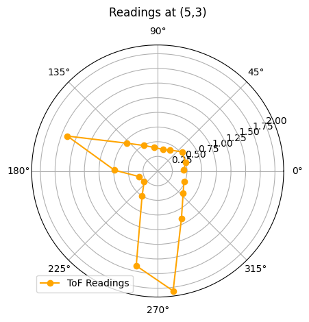
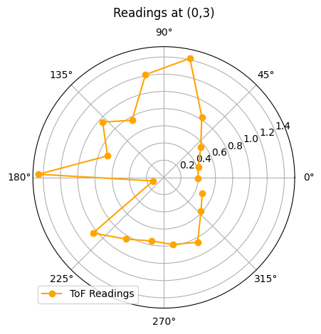
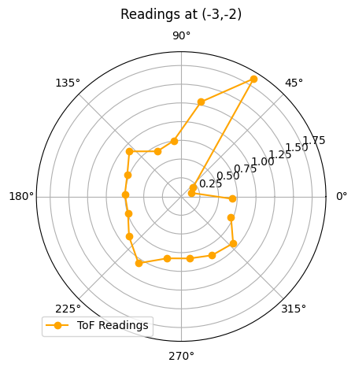
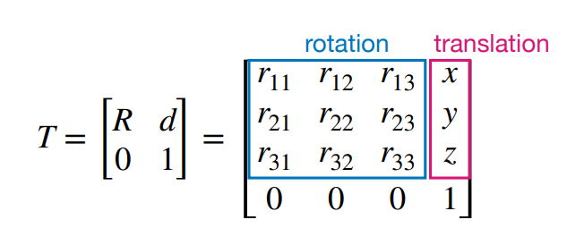

# Lab 9: Mapping

In Lab 9, I implemented a mapping routine to generate a spatial representation of a static room using my RC robot. By rotating the robot in place at marked locations, I collected Time-of-Flight (ToF) distance measurements and used orientation data from the IMU to associate each measurement with an angle. I then transformed these local readings into a global reference frame using transformation matrices. Finally, I visualized the mapped environment and approximated the walls using line segments to create a line-based map for future localization and navigation tasks.

* * *
 
## Prelab

As mentioned in Lab 8, my RC car exhibited an issue where only one side of the wheels would spin when sending the forward signal to both sets, and only the opposite side would spin when sending the backward signal. To identify the cause, I used an oscilloscope to probe the motor driver's input and output signals and tested with a DC power supply rather than a battery. 



While scoping, I observed that some of the outputs were very noisy, although I could not pinpoint the exact issue. As a result, I decided to replace the motor driver entirely. After the replacement, the RC car functioned as expected and the problem was resolved.


I then focused on fixing the implementation of the stunt command from Lab 8 since Lab 9 required reliable collection of both ToF and IMU data, which I was unable to achieve during the stunt routine. Although the motors were controlled correctly, the function only collected sensor data for approximately 0.4 seconds even though the intended runtime was 5 seconds. By inserting Serial print statements to debug the function, I discovered that the index variable was being incremented outside the condition that checks for valid sensor data. This caused empty entries in the data arrays and led the program to exit the loop early when the condition `if (time_data[j] != 0)`  failed. To resolve this, I modified the logic so that the index increments only when valid sensor data is received.


```c
case STUNT:  {
    
    // Serial.println("STUNT command received!");
    float u_0;
    NReversed = true;

    // Extract the next value from the command string as an integer
    success = robot_cmd.get_next_value(u_0);
    if (!success)
        return;


    motor_control(u_0);

    // delay(2000);

    // motor_control(-u_0);

    // delay(2000);

    // analogWrite(PWM_0, 0);
    // analogWrite(PWM_1, 0);
    // analogWrite(PWM_3, 0);
    // analogWrite(PWM_5, 0);


    memset(time_data, 0, sizeof(time_data));
    memset(time_data2, 0, sizeof(time_data2));
    memset(distance_data, 0, sizeof(distance_data));
    memset(roll_data, 0, sizeof(roll_data));
    memset(pitch_data, 0, sizeof(pitch_data));
    memset(yaw_data, 0, sizeof(yaw_data));
    // memset(u, 0, sizeof(u));

    i = 0;
    i2 = 0;

    unsigned long start_time = millis();

    distanceSensor.setDistanceModeShort();
    distanceSensor.startRanging(); //Write configuration bytes to initiate measurement

    while ((millis() - start_time < 5000) && (i < array_size)) {

        if ((millis() - start_time > 2000) && (NReversed == true)) {
          analogWrite(PWM_0, 255);
          analogWrite(PWM_1, 255);
          analogWrite(PWM_3, 255);
          analogWrite(PWM_5, 255);

          NReversed = false;
        }

        icm_20948_DMP_data_t data;
        myICM.readDMPdataFromFIFO(&data);

        // Is valid data available?
        if ((myICM.status == ICM_20948_Stat_Ok) || (myICM.status == ICM_20948_Stat_FIFOMoreDataAvail)) {
            // We have asked for GRV data so we should receive Quat6
            if ((data.header & DMP_header_bitmap_Quat6) > 0) {
                double qy = ((double)data.Quat6.Data.Q1) / 1073741824.0; // Convert to double. Divide by 2^30
                double qx = ((double)data.Quat6.Data.Q2) / 1073741824.0; // Convert to double. Divide by 2^30
                double qz = -((double)data.Quat6.Data.Q3) / 1073741824.0; // Convert to double. Divide by 2^30
                double qw = sqrt(1.0 - ((qy * qy) + (qx * qx) + (qz* qz)));

                // Convert the quaternion to Euler angles...

                // roll (x-axis rotation)
                double t0 = +2.0 * (qw * qx + qy * qz);
                double t1 = +1.0 - 2.0 * (qx * qx + qy * qy);
                roll_data[i] = atan2(t0, t1) * 180.0 / PI;

                // // pitch (y-axis rotation)
                // double t2 = +2.0 * (qw * qy - qx * qz);
                // t2 = t2 > 1.0 ? 1.0 : t2;
                // t2 = t2 < -1.0 ? -1.0 : t2;
                // pitch_data[i] = asin(t2) * 180.0 / PI;

                // yaw (z-axis rotation)
                double t3 = +2.0 * (qw * qz + qx * qy);
                double t4 = +1.0 - 2.0 * (qy * qy + qz * qz);
                yaw_data[i] = atan2(t3, t4) * 180.0 / PI;
                
                time_data[i] = (int) millis();
                Serial.println(time_data[i]);
                i++;

            }
        }

        if (distanceSensor.checkForDataReady())
        {
          distance_data[i2] = distanceSensor.getDistance(); //Get the result of the measurement from the sensor
          time_data2[i2] = (int) millis();
          distanceSensor.clearInterrupt();
          distanceSensor.stopRanging();
          distanceSensor.startRanging();
          i2++;
        }

    }

    analogWrite(PWM_0, 0);
    analogWrite(PWM_1, 0);
    analogWrite(PWM_3, 0);
    analogWrite(PWM_5, 0);

    // Serial.println("Sending Data");

    //Send back the array
    for (int j = 0; j < array_size; j++) {

      if (time_data[j] != 0 || time_data2[j] != 0) {

        tx_estring_value.clear();
        tx_estring_value.append("Time:");
        tx_estring_value.append(time_data[j]);
        Serial.println(time_data[j]);
        tx_estring_value.append(", Time2:");
        tx_estring_value.append(time_data2[j]);
        // tx_estring_value.append(", Distance:");
        // tx_estring_value.append(distance_data[j]);
        // tx_estring_value.append(", roll:");
        // tx_estring_value.append(roll_data[j]);
        // // tx_estring_value.append(", pitch:");
        // // tx_estring_value.append(pitch_data[j]);
        // tx_estring_value.append(", yaw:");
        // tx_estring_value.append(yaw_data[j]);
        // // tx_estring_value.append(", u:");
        // // tx_estring_value.append(u[j]);
        tx_characteristic_string.writeValue(tx_estring_value.c_str());
        // Serial.println(time_data[j]);

      } else break;


    }

    // Serial.println("STUNT done");

    break;
}
```

## Orientation Control

I decided to tune my PID orientation controller to enable the robot to perform on-axis turns in small, accurate increments. To achieve this, I re-implemented the ORIENT_DMP_P command from Lab 6 and modified it to accept a delta angle rather than an absolute target. This delta defined the incremental step size for the desired orientation. I then placed the proportional control logic inside a for-loop to sequentially step through each target angle, allowing the robot to rotate in controlled increments.

```c
case ORIENT_DMP_P:  {
    

    // Extract the next value from the command string as an integer
    success = robot_cmd.get_next_value(K_p);
    if (!success)
        return;

    // Extract the next value from the command string as an integer
    success = robot_cmd.get_next_value(delta_angle);
    if (!success)
        return;

    memset(time_data, 0, sizeof(time_data));
    memset(yaw_data, 0, sizeof(yaw_data));
    memset(u, 0, sizeof(u));
    memset(angle_A, 0, sizeof(angle_A));

    i = 0;

    

     // Step through 360 degrees by the given increments
    for (int angle = 0; angle < 360; angle += delta_angle) {

        unsigned long start_time = millis();

        while ((millis() - start_time < 3000) && (i < array_size)) {

            icm_20948_DMP_data_t data;
            myICM.readDMPdataFromFIFO(&data);

            // Is valid data available?
            if ((myICM.status == ICM_20948_Stat_Ok) || (myICM.status == ICM_20948_Stat_FIFOMoreDataAvail)) {
                // We have asked for GRV data so we should receive Quat6
                if ((data.header & DMP_header_bitmap_Quat6) > 0) {
                    double qy = ((double)data.Quat6.Data.Q1) / 1073741824.0; // Convert to double. Divide by 2^30
                    double qx = ((double)data.Quat6.Data.Q2) / 1073741824.0; // Convert to double. Divide by 2^30
                    double qz = -((double)data.Quat6.Data.Q3) / 1073741824.0; // Convert to double. Divide by 2^30
                    double qw = sqrt(1.0 - ((qy * qy) + (qx * qx) + (qz* qz)));

                    // Convert the quaternion to Euler angles...

                    double t3 = +2.0 * (qw * qz + qx * qy);
                    double t4 = +1.0 - 2.0 * (qy * qy + qz * qz);
                    yaw_data[i] = atan2(t3, t4) * 180.0 / PI;
                    
                    time_data[i] = (int) millis();
                    float e = angle-yaw_data[i];
                    u[i] = K_p*e;
                    spin_control(u[i]);
                    angle_A[i]=angle;
                    i++;
                    
                }
            }
            
        }


    }

    analogWrite(PWM_0, 0);
    analogWrite(PWM_1, 0);
    analogWrite(PWM_3, 0);
    analogWrite(PWM_5, 0);

    //Send back the array
    for (int j = 0; j < array_size; j++) {

      if (time_data[j] != 0) {

        tx_estring_value.clear();
        tx_estring_value.append("Time:");
        tx_estring_value.append(time_data[j]);
        tx_estring_value.append(", yaw:");
        tx_estring_value.append(yaw_data[j]);
        tx_estring_value.append(", u:");
        tx_estring_value.append(u[j]);
        tx_estring_value.append(", angle:");
        tx_estring_value.append(angle_A[j]);
        tx_characteristic_string.writeValue(tx_estring_value.c_str());

      } else break;

    }

    break;
}
```
This is the result.

<div style="display: flex; justify-content: center; align-items: center; height: 100%;">
  <iframe width="560" height="315" src="https://www.youtube.com/embed/jrZTYHFDVTs" title="Fast Robots Lab 9: Incrementing Angle" frameborder="0" allow="accelerometer; autoplay; clipboard-write; encrypted-media; gyroscope; picture-in-picture; web-share" referrerpolicy="strict-origin-when-cross-origin" allowfullscreen></iframe>
</div>
<br>

There were several issues with the performance of my RC car. During testing, the robot rotated more than 360 degrees and eventually disconnected from Bluetooth. Based on similar issues in earlier labs, I initially suspected the disconnection was caused by how data was being transmitted. However, the robot’s behavior also suggested that either the calibration factor or the tuning of the PID orientation controller was incorrect, likely due to the recent replacement of the motor driver. To isolate the problem, I ran the SPIN_TEST command to check if the robot could still perform on-axis turns. While the robot connected to Bluetooth successfully, it disconnected within 15 seconds before I was even able to run a command. This suggests that the disconnection issue may not be related to data transmission but instead to another underlying factor.

## Orientation Control Continued

To complete this lab despite ongoing Bluetooth connection issues, I switched to using another student's robot. In order to use their hardware, I adjusted my calibration factor, updated the motor control pins, and modified the sign of the orientation error to ensure the motors responded correctly. To further implement my orientation control, I converted the orientation command from Lab 6 into a function, allowing for smoother integration for a mapping command.
```c
void ORIENT_DMP_P(float target){      

    // for (int warmup = 0; warmup < 50; warmup++) {

    //     icm_20948_DMP_data_t dummy;
    //     myICM.readDMPdataFromFIFO(&dummy);
    //     delay(20);

    // }

    unsigned long start_time = millis();


    while (millis() - start_time < settling_time) {

        icm_20948_DMP_data_t data;
        myICM.readDMPdataFromFIFO(&data);

        // Is valid data available?
        if ((myICM.status == ICM_20948_Stat_Ok) || (myICM.status == ICM_20948_Stat_FIFOMoreDataAvail)) {
            // We have asked for GRV data so we should receive Quat6
            if ((data.header & DMP_header_bitmap_Quat6) > 0) {
                double qy = ((double)data.Quat6.Data.Q1) / 1073741824.0; // Convert to double. Divide by 2^30
                double qx = ((double)data.Quat6.Data.Q2) / 1073741824.0; // Convert to double. Divide by 2^30
                double qz = -((double)data.Quat6.Data.Q3) / 1073741824.0; // Convert to double. Divide by 2^30
                double qw = sqrt(1.0 - ((qy * qy) + (qx * qx) + (qz* qz)));

                // Convert the quaternion to Euler angles...

                double t3 = +2.0 * (qw * qz + qx * qy);
                double t4 = +1.0 - 2.0 * (qy * qy + qz * qz);
                float yaw = atan2(t3, t4) * 180.0 / PI;
                
                int time = (int) millis();
                float e = angle_difference(target, yaw);
                float u = K_p*e;
                spin_control(u);
                
            }
        }
        
    }

    analogWrite(PWM_0, 0);
    analogWrite(PWM_1, 0);
    analogWrite(PWM_3, 0);
    analogWrite(PWM_5, 0);

}
```

I also created an `angle_difference()` function to correctly calculate error, accounting for the DMP’s wrapping behavior from 0 to 180 and -180 to 0 degrees. During early testing of my mapping function, I encountered unexpected behavior near the wraparound boundary, which led to incorrect error calculations. Incorporating this function resolved the discontinuities and ensured smooth and accurate orientation updates throughout the robot’s rotation.

```c
float angle_difference(float target_angle, float current_angle) {
    float diff = current_angle - target_angle;
    diff = fmod((diff + 180.0), 360.0);
    if (diff < 0)
        diff += 360.0;
    return diff - 180.0;
}
```

<div style="display: flex; justify-content: center; align-items: center; height: 100%;">
  <iframe width="560" height="315" src="https://www.youtube.com/embed/hjztvWUd7w8" title="Fast Robots Lab 9: Spinning When Going Past 180°" frameborder="0" allow="accelerometer; autoplay; clipboard-write; encrypted-media; gyroscope; picture-in-picture; web-share" referrerpolicy="strict-origin-when-cross-origin" allowfullscreen></iframe>
</div>
<br>

I ended up converted the P controller into a PD controller to address oscillatory behavior observed during turning. The robot was exhibiting a snaking motion, which caused it to move away from the target Point it was supposed to be turning about on its axis. Adding the derivative term helped dampen these oscillations and improved stability, allowing the robot to maintain a more accurate positioning.

```c
void ORIENT_DMP_PD(float target) {
    unsigned long start_time = millis();
    float ep_prev = 0;
    int t_prev = millis();

    while (millis() - start_time < settling_time) {

        icm_20948_DMP_data_t data;
        myICM.readDMPdataFromFIFO(&data);

        if ((myICM.status == ICM_20948_Stat_Ok) || (myICM.status == ICM_20948_Stat_FIFOMoreDataAvail)) {
            if ((data.header & DMP_header_bitmap_Quat6) > 0) {
                double qy = ((double)data.Quat6.Data.Q1) / 1073741824.0;
                double qx = ((double)data.Quat6.Data.Q2) / 1073741824.0;
                double qz = -((double)data.Quat6.Data.Q3) / 1073741824.0;
                double qw = sqrt(1.0 - ((qy * qy) + (qx * qx) + (qz * qz)));

                double t3 = +2.0 * (qw * qz + qx * qy);
                double t4 = +1.0 - 2.0 * (qy * qy + qz * qz);
                float yaw = atan2(t3, t4) * 180.0 / PI;

                int t_curr = millis();
                float ep = angle_difference(target, yaw);
                int dt = t_curr - t_prev;
                if (dt == 0) dt = 1;  // avoid divide-by-zero

                float ed = (ep - ep_prev) / dt;

                float u = K_p * ep + K_d * ed;
                spin_control(u);

                // update for next iteration
                ep_prev = ep;
                t_prev = t_curr;
            }
        }
    }

    analogWrite(PWM_0, 0);
    analogWrite(PWM_1, 0);
    analogWrite(PWM_3, 0);
    analogWrite(PWM_5, 0);
}
```

## Mapping

My general strategy for mapping using the orientation control function was to increment the desired angle step by step. At each increment, I used proportional control to rotate the robot to the target angle. Once a non-zero IMU reading confirmed the orientation update, I recorded the angle. I then waited for the distance sensor to become ready, recorded the corresponding distance, and proceeded to the next angle increment. This process continued until the full rotation was completed.

```c
case MAPPING:  {

    // Extract the next value from the command string as an integer
    success = robot_cmd.get_next_value(K_p);
    if (!success)
        return;

    // Extract the next value from the command string as an integer
    success = robot_cmd.get_next_value(settling_time);
    if (!success)
        return;
  
    float increment = 20.0;


    memset(time_data, 0, sizeof(time_data));
    memset(distance_data, 0, sizeof(distance_data));
    memset(yaw_data, 0, sizeof(yaw_data));


    i = 0;

    distanceSensor.setDistanceModeShort();
    distanceSensor.startRanging(); //Write configuration bytes to initiate measurement

    for (float angle = -20.0; angle < 360.0; angle += increment) {
        
        float adjusted_angle = fmod(angle + 180.0, 360.0) - 180.0;
        ORIENT_DMP_P(adjusted_angle);
        
        while(1){

            icm_20948_DMP_data_t data;
            myICM.readDMPdataFromFIFO(&data);

            // Is valid data available?
            if ((myICM.status == ICM_20948_Stat_Ok) || (myICM.status == ICM_20948_Stat_FIFOMoreDataAvail)) {
                // We have asked for GRV data so we should receive Quat6
                if ((data.header & DMP_header_bitmap_Quat6) > 0) {
                    double qy = ((double)data.Quat6.Data.Q1) / 1073741824.0; // Convert to double. Divide by 2^30
                    double qx = ((double)data.Quat6.Data.Q2) / 1073741824.0; // Convert to double. Divide by 2^30
                    double qz = -((double)data.Quat6.Data.Q3) / 1073741824.0; // Convert to double. Divide by 2^30
                    double qw = sqrt(1.0 - ((qy * qy) + (qx * qx) + (qz* qz)));

                    // Convert the quaternion to Euler angles...

                    // yaw (z-axis rotation)
                    double t3 = +2.0 * (qw * qz + qx * qy);
                    double t4 = +1.0 - 2.0 * (qy * qy + qz * qz);
                    yaw_data[i] = atan2(t3, t4) * 180.0 / PI; 

                    break;

                }

            }
        }

        while (!distanceSensor.checkForDataReady()) {
            delay(1);  // small delay to avoid tight loop
        }

        distance_data[i] = distanceSensor.getDistance();
        time_data[i] = (int)millis();
        distanceSensor.clearInterrupt();
        distanceSensor.stopRanging();
        distanceSensor.startRanging();

        i++;
        if (i >= array_size) break; // prevent overflow


    }

    analogWrite(PWM_0, 0);
    analogWrite(PWM_1, 0);
    analogWrite(PWM_3, 0);
    analogWrite(PWM_5, 0);

    // Serial.println("Sending Data");

    //Send back the array
    for (int j = 0; j < array_size; j++) {

      if (time_data[j] != 0 ) {

        tx_estring_value.clear();
        tx_estring_value.append("Distance:");
        tx_estring_value.append(distance_data[j]);
        tx_estring_value.append(", yaw:");
        tx_estring_value.append(yaw_data[j]);
        tx_characteristic_string.writeValue(tx_estring_value.c_str());


      } else break;


    }

    // Serial.println("STUNT done");

    break;
}
```

I observed that the quality of the on-axis turns varied slightly from one increment to the next. However, the robot consistently remained close to its starting position and did not drift significantly. It typically stayed within the same floor tile as the point, indicating that the overall deviation was minor and acceptable for mapping purposes.


### (5,-3)

<div style="display: flex; justify-content: center; align-items: center; gap: 20px; flex-wrap: wrap;">
  
  <iframe width="560" height="315" src="https://www.youtube.com/embed/R6e5773sN3I" title="Fast Robots Lab 9: Mapping (5,-3)" frameborder="0" allow="accelerometer; autoplay; clipboard-write; encrypted-media; gyroscope; picture-in-picture; web-share" referrerpolicy="strict-origin-when-cross-origin" allowfullscreen></iframe>
</div>
<br>


### (5,3)

<div style="display: flex; justify-content: center; align-items: center; gap: 20px; flex-wrap: wrap;">
  
  <iframe width="560" height="315" src="https://www.youtube.com/embed/jvro13ow9_Y" title="Fast Robots Lab 9: Mapping (5,3)" frameborder="0" allow="accelerometer; autoplay; clipboard-write; encrypted-media; gyroscope; picture-in-picture; web-share" referrerpolicy="strict-origin-when-cross-origin" allowfullscreen></iframe>
</div>
<br>

### (0,3)

<div style="display: flex; justify-content: center; align-items: center; gap: 20px; flex-wrap: wrap;">
  
  <iframe width="560" height="315" src="https://www.youtube.com/embed/51t4djG8ICU" title="Fast Robots Lab 9: Mapping (0,3)" frameborder="0" allow="accelerometer; autoplay; clipboard-write; encrypted-media; gyroscope; picture-in-picture; web-share" referrerpolicy="strict-origin-when-cross-origin" allowfullscreen></iframe>
</div>
<br>

### (-3,-2)

<div style="display: flex; justify-content: center; align-items: center; gap: 20px; flex-wrap: wrap;">
  
  <iframe width="560" height="315" src="https://www.youtube.com/embed/2Hy-CPEAqes" title="Fast Robots Lab 9: Mapping (-3,-2)" frameborder="0" allow="accelerometer; autoplay; clipboard-write; encrypted-media; gyroscope; picture-in-picture; web-share" referrerpolicy="strict-origin-when-cross-origin" allowfullscreen></iframe>
</div>
<br>

## Transformation Matrices

With scans collected at each of the specified coordinates, the next step was to convert the distance sensor readings from the robot’s local frame into the inertial reference frame of the room. With homogeneous transformation matrix all measurements to be plotted can be plotted in a common global coordinate system for accurate map construction.




## Discussion

This lab emphasized the importance of accurate sensor data collection and reliable control when performing mapping tasks. It provided experience with IMU and ToF sensor data for 2D spatial understanding. The process of debugging the motor drivers, and requisition of data from the ToF and IMU reinforced the value of methodical testing and system-level troubleshooting. This lab laid a strong foundation for future work in localization and autonomous navigation.

* * *

# Acknowledgements
*   I referenced Stephan Wagner's page.

