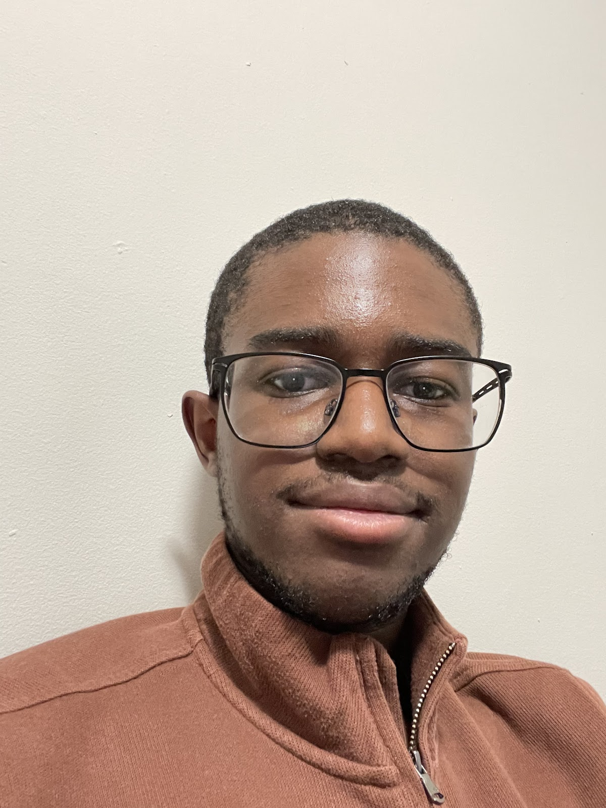

# About Me

Hello! My name is Kotey Ashie, and I’m a double major in Mechanical Engineering and Electrical & Computer Engineering with a minor in Robotics at Cornell University. My main interest lies in robotics. In my free time, I enjoy reading web novels and watching anime.

 
 
 
 
 
* * *

## Labs
- [Lab 1: The Artemis Board and Bluetooth](docs/pages/lab1.md)
